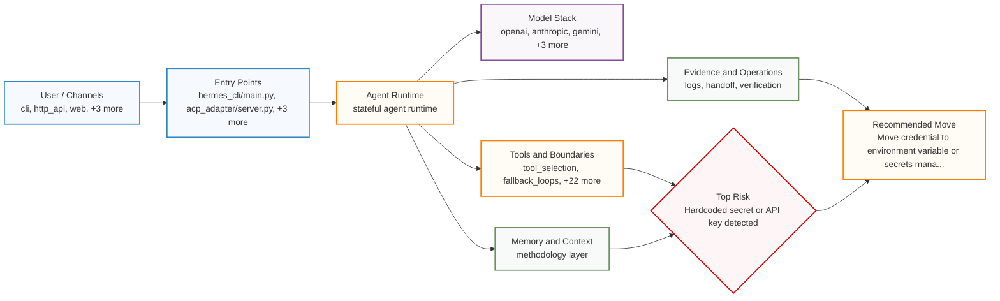

# Agent Architecture Audit Report

**Target**: `.`
**Profile**: `personal_development`
**Date**: 2026-04-30T09:48:10.613904
**Duration**: 123.57s
**Overall Health**: **critical**
**Architecture Era**: **青铜时代** (30/100)
**Primary Failure Mode**: Hardcoded secret or API key detected
**Most Urgent Fix**: Move credential to environment variable or secrets manager (e.g., AWS Secrets Manager, Doppler). Add pre-commit hook to block secret commits.

## Scope

- Entry points: hermes_cli/main.py, acp_adapter/server.py, plugins/google_meet/node/server.py, tui_gateway/server.py, ui-tui/packages/hermes-ink/index.js
- Channels: cli, http_api, web, slack, discord, telegram
- Model stack: openai, anthropic, gemini, ollama, bedrock, llama
- Audited layers: tool_selection, fallback_loops, completion_closure, active_recall, runtime_bug_inference, platform_rendering, tool_execution, token_usage, session_history, long_term_memory, knowledge_retrieval, self_evolution, persistence, impression_memory, os_memory, os_scheduler, os_syscall, os_vfs, stateful_recovery, llm_cli_workers, plugin_execution, remote_tools, answer_shaping, pipeline_middleware

## Summary

> 这个 Agent 项目处于 青铜时代（30/100）：开始有事实、技能或工具，但边界和调度仍比较粗糙。

| Severity | Count |
|----------|-------|
| 🔴 CRITICAL | 1 |
| 🟠 HIGH | 6 |
| 🟡 MEDIUM | 38 |
| 🟢 LOW | 76 |

**Total findings**: 121

## Architecture Analysis

**Posture**: **stateful agent runtime**. The scan reads this project as `青铜时代` with `30/100` maturity.
**Best signal**: methodology layer.
**Main drag**: Hardcoded secret or API key detected.
**Next move**: Keep the current architecture contract covered by tests and evidence

### Architecture Map

### Risk Hotspots

| Layer | Risk Weight | Leading Signal |
|-------|-------------|----------------|
| output_pipeline | 68 | Output mutation / response transformation detected |
| code_execution | 50 | Unsafe code execution: subprocess(shell=True) |
| llm_routing | 22 | Hidden or secondary LLM call detected |
| memory_management | 8 | Memory growth without apparent limit |

### Reading Guide

- The orange center is the runtime contract agchk inferred from the repo.
- Green nodes are capabilities that make the agent easier to operate, resume, and improve.
- The red diamond is the first architectural bottleneck a maintainer should feel in day-to-day work.

## Architecture Era Score

- Era: **青铜时代**
- Score: **30/100**
- Raw points: `300`
- Capped raw points: `100`
- Pre-penalty score: `100`
- Finding penalty: `70` (uncapped `144`, cap `70`)
- Formula: `min(100, raw_points=300) -> capped/gated pre_penalty=100; minus penalty=min(144, cap=70)=70; final=30`
- Methodology gate: 已发现方法论层，项目具备进入青铜以上时代的地基。
- Self-evolution gate: 已发现完整自我进化闭环，项目具备持续吸收外部信号并验证改造的能力。
- Meaning: 开始有事实、技能或工具，但边界和调度仍比较粗糙。

### Positive Signal Ledger

| Signal | Points | Evidence |
|--------|--------|----------|
| impression pointers | +12 | `audit_report.md:63` `audit_results.json:101` |
| methodology layer | +12 | `.agchk/OPTIMIZATION_PLAYBOOK.md:163` `.agchk/generate_playbook.py:166` +1 more |
| restart session recall | +12 | `hermes_cli/web_server.py:1958` `website/docs/guides/automate-with-cron.md:147` |
| memory lifecycle governance | +10 | `.plans/streaming-support.md:369` `.plans/streaming-support.md:467` +1 more |
| semantic paging | +10 | `.agchk/self_audit_mechanism.md:93` `.agchk/self_audit_mechanism.md:109` +1 more |
| stateful recovery | +10 | `hermes_state.py:1374` |
| token-efficient context layer | +10 | `README.md:59` `README.md:60` +1 more |
| permission policy | +9 | `RELEASE_v0.2.0.md:240` `RELEASE_v0.2.0.md:369` +1 more |
| LLM CLI workers | +8 | `RELEASE_v0.11.0.md:18` `RELEASE_v0.11.0.md:56` +1 more |
| RAG governance | +8 | `agent/anthropic_adapter.py:73` `agent/anthropic_adapter.py:76` +1 more |
| before/after evidence logging | +8 | `.agchk/OPTIMIZATION_COMPLETED.md:3` `.agchk/OPTIMIZATION_COMPLETED.md:22` +1 more |
| capability table | +8 | `AGENTS.md:480` `CONTRIBUTING.md:16` +1 more |
| environment-as-state | +8 | `.plans/streaming-support.md:611` `RELEASE_v0.11.0.md:32` +1 more |
| fair scheduling | +8 | `.plans/openai-api-server.md:249` `.plans/streaming-support.md:352` +1 more |
| impression cues | +8 | `audit_report.md:21` `audit_report.md:39` +1 more |
| page-fault recovery | +8 | `RELEASE_v0.9.0.md:26` `audit_report.md:21` +1 more |
| plugin sandbox policy | +8 | `.plans/streaming-support.md:14` `.plans/streaming-support.md:152` +1 more |
| remote tool boundary | +8 | `AGENTS.md:505` `README.md:448` +1 more |
| scheduler/workers | +8 | `.agchk/self_audit_mechanism.md:227` `AGENTS.md:52` +1 more |
| semantic VFS | +8 | `AGENTS.md:145` `AGENTS.md:460` +1 more |
| tool/syscall boundary | +8 | `.plans/openai-api-server.md:179` `.plans/streaming-support.md:240` +1 more |
| daemon lifecycle safety | +7 | `.plans/streaming-support.md:339` `.plans/streaming-support.md:456` +1 more |
| learning assetization | +7 | `README.md:173` |
| middleware observability | +7 | `.plans/openai-api-server.md:52` `.plans/openai-api-server.md:229` +1 more |
| multilingual memory retrieval | +7 | `RELEASE_v0.8.0.md:157` `RELEASE_v0.8.0.md:296` +1 more |
| skill memory | +7 | `.plans/openai-api-server.md:146` `AGENTS.md:46` +1 more |
| task envelope | +7 | `.plans/streaming-support.md:454` `.plans/streaming-support.md:455` +1 more |
| traces/evals | +7 | `.agchk/OPTIMIZATION_PLAYBOOK.md:42` `.agchk/OPTIMIZATION_PLAYBOOK.md:47` +1 more |
| fact memory | +6 | `.agchk/OPTIMIZATION_COMPLETED.md:76` `.agchk/OPTIMIZATION_PLAYBOOK.md:134` +1 more |
| handoff/workbook habit | +6 | `README.md:178` `README.md:498` +1 more |
| hands-on validation | +6 | `AGENTS.md:649` `AGENTS.md:651` +1 more |
| verification closure | +6 | `.agchk/OPTIMIZATION_COMPLETED.md:101` `.agchk/OPTIMIZATION_PLAYBOOK.md:152` +1 more |
| agent runtime | +5 | `.agchk/benchmark.py:3` `.agchk/benchmark.py:142` +1 more |
| constraint adaptation | +5 | `acp_adapter/session.py:246` `agent/skill_utils.py:1` +1 more |
| context compaction | +5 | `.plans/streaming-support.md:618` `.plans/streaming-support.md:620` +1 more |
| pattern extraction | +5 | `agent/auxiliary_client.py:1606` `optional-skills/DESCRIPTION.md:5` +1 more |
| small-step landing | +5 | `RELEASE_v0.2.0.md:25` `RELEASE_v0.2.0.md:190` +1 more |
| source-level learning | +5 | `RELEASE_v0.11.0.md:276` `RELEASE_v0.3.0.md:95` +1 more |
| CLI prompt contract | +4 | `audit_report.md:232` `audit_report.md:236` +1 more |
| external signal intake | +4 | `.agchk/OPTIMIZATION_COMPLETED.md:69` `.agchk/OPTIMIZATION_COMPLETED.md:79` +1 more |

### Penalty Ledger

| Finding | Severity | Penalty | Evidence | Fix Direction |
|---------|----------|---------|----------|---------------|
| Permission policy is not enforced on all dispatch paths | HIGH | -14 (rule 9 + severity 5) | `RELEASE_v0.7.0.md:158` +2 more | Move permission enforcement to the shared tool-dispatch boundary, or add equivalent checks to every sequential, concurrent, scheduled, and delegated execution path before tool i... |
| Hardcoded secret or API key detected | CRITICAL | -12 (rule 0 + severity 12) | `tests/agent/test_redact.py:70` | Move credential to environment variable or secrets manager (e.g., AWS Secrets Manager, Doppler). Add pre-commit hook to block secret commits. |
| Internal orchestration sprawl detected | HIGH | -11 (rule 6 + severity 5) | `run_agent.py:1631` +2 more | Collapse overlapping coordination layers where possible. Keep one clear main loop, minimize hidden fallback paths, and document which module owns planning, routing, and retries. |
| Memory freshness / generation confusion detected | HIGH | -11 (rule 6 + severity 5) | `ui-tui/src/app/slash/commands/session.ts` +2 more | Define one authoritative current memory surface and make archives or summaries explicitly secondary. Rename or retire overlapping generations so humans and agents can tell what ... |
| Role-play handoff orchestration detected | HIGH | -10 (rule 5 + severity 5) | `audit_report.md:71` +2 more | Keep one agent or loop responsible for the full user intent. Use subagents for independent evidence gathering or context isolation, then merge results back to the intent owner. ... |
| Runtime surface sprawl detected | HIGH | -5 (rule 0 + severity 5) | `UPDATE_PROCESS.md:69` +2 more | Reduce the number of runtime surfaces each developer must hold in their head. Document the primary runtime path and separate optional services or deployment layers more clearly. |
| Startup surface sprawl detected | HIGH | -5 (rule 0 + severity 5) | `docker-compose.yml` +2 more | Choose one canonical startup path for development and one for background/service operation. Reduce wrapper layers and document the exact order in which launchers delegate to eac... |
| Duplicated skill / SOP artifacts detected | MEDIUM | -2 (rule 0 + severity 2) | `tools/skills_hub.py` +2 more | Pick one canonical skill or SOP per task shape. Archive or delete duplicated variants and keep version history in Git rather than in multiple near-identical files. |
| Hidden or secondary LLM call detected | MEDIUM | -2 (rule 0 + severity 2) | `tools/mixture_of_agents_tool.py:146` | This may be acceptable in a personal prototype if the extra call is intentional and well understood. If the project grows or is shared with others, document the secondary path a... |
| Hidden or secondary LLM call detected | MEDIUM | -2 (rule 0 + severity 2) | `tools/mixture_of_agents_tool.py:221` | This may be acceptable in a personal prototype if the extra call is intentional and well understood. If the project grows or is shared with others, document the secondary path a... |
| Hidden or secondary LLM call detected | MEDIUM | -2 (rule 0 + severity 2) | `tools/mixture_of_agents_tool.py:228` | This may be acceptable in a personal prototype if the extra call is intentional and well understood. If the project grows or is shared with others, document the secondary path a... |
| Hidden or secondary LLM call detected | MEDIUM | -2 (rule 0 + severity 2) | `agent/tool_router.py:200` | This may be acceptable in a personal prototype if the extra call is intentional and well understood. If the project grows or is shared with others, document the secondary path a... |
| Hidden or secondary LLM call detected | MEDIUM | -2 (rule 0 + severity 2) | `agent/auxiliary_client.py:3451` | This may be acceptable in a personal prototype if the extra call is intentional and well understood. If the project grows or is shared with others, document the secondary path a... |
| Hidden or secondary LLM call detected | MEDIUM | -2 (rule 0 + severity 2) | `agent/auxiliary_client.py:3699` | This may be acceptable in a personal prototype if the extra call is intentional and well understood. If the project grows or is shared with others, document the secondary path a... |
| Hidden or secondary LLM call detected | MEDIUM | -2 (rule 0 + severity 2) | `agent/auxiliary_client.py:3741` | This may be acceptable in a personal prototype if the extra call is intentional and well understood. If the project grows or is shared with others, document the secondary path a... |
| Hidden or secondary LLM call detected | MEDIUM | -2 (rule 0 + severity 2) | `agent/transports/anthropic.py:48` | This may be acceptable in a personal prototype if the extra call is intentional and well understood. If the project grows or is shared with others, document the secondary path a... |
| Hidden or secondary LLM call detected | MEDIUM | -2 (rule 0 + severity 2) | `agent/transports/chat_completions.py:154` | This may be acceptable in a personal prototype if the extra call is intentional and well understood. If the project grows or is shared with others, document the secondary path a... |
| Hidden or secondary LLM call detected | MEDIUM | -2 (rule 0 + severity 2) | `skills/red-teaming/godmode/scripts/auto_jailbreak.py:355` | This may be acceptable in a personal prototype if the extra call is intentional and well understood. If the project grows or is shared with others, document the secondary path a... |
| Hidden or secondary LLM call detected | MEDIUM | -2 (rule 0 + severity 2) | `skills/red-teaming/godmode/scripts/godmode_race.py:286` | This may be acceptable in a personal prototype if the extra call is intentional and well understood. If the project grows or is shared with others, document the secondary path a... |
| Timer delay may exceed runtime setTimeout limits | MEDIUM | -2 (rule 0 + severity 2) | `ui-tui/packages/hermes-ink/src/ink/ink.tsx:1028` +1 more | Route long delays through a shared timer helper that clamps to the Node/JS setTimeout cap, logs truncation, and has regression tests for multi-day or extremely large durations. |
| Unsafe code execution: compile( | MEDIUM | -2 (rule 0 + severity 2) | `tests/tools/test_code_execution.py:458` | Do not feed untrusted input into exec/eval/shell execution. For personal or local prototyping, you can keep controlled execution paths when the input is trusted and the blast ra... |
| Unsafe code execution: compile( | MEDIUM | -2 (rule 0 + severity 2) | `skills/red-teaming/godmode/scripts/auto_jailbreak.py:52` | Do not feed untrusted input into exec/eval/shell execution. For personal or local prototyping, you can keep controlled execution paths when the input is trusted and the blast ra... |
| Unsafe code execution: compile( | MEDIUM | -2 (rule 0 + severity 2) | `skills/red-teaming/godmode/scripts/auto_jailbreak.py:54` | Do not feed untrusted input into exec/eval/shell execution. For personal or local prototyping, you can keep controlled execution paths when the input is trusted and the blast ra... |
| Unsafe code execution: compile( | MEDIUM | -2 (rule 0 + severity 2) | `skills/red-teaming/godmode/scripts/load_godmode.py:29` | Do not feed untrusted input into exec/eval/shell execution. For personal or local prototyping, you can keep controlled execution paths when the input is trusted and the blast ra... |
| Unsafe code execution: eval( | MEDIUM | -2 (rule 0 + severity 2) | `tests/run_agent/test_agent_loop_vllm.py:156` | Do not feed untrusted input into exec/eval/shell execution. For personal or local prototyping, you can keep controlled execution paths when the input is trusted and the blast ra... |
| Unsafe code execution: eval( | MEDIUM | -2 (rule 0 + severity 2) | `tests/run_agent/test_agent_loop_tool_calling.py:177` | Do not feed untrusted input into exec/eval/shell execution. For personal or local prototyping, you can keep controlled execution paths when the input is trusted and the blast ra... |
| Unsafe code execution: exec( | MEDIUM | -2 (rule 0 + severity 2) | `tests/agent/test_bedrock_adapter.py:1320` | Do not feed untrusted input into exec/eval/shell execution. For personal or local prototyping, you can keep controlled execution paths when the input is trusted and the blast ra... |
| Unsafe code execution: exec( | MEDIUM | -2 (rule 0 + severity 2) | `tests/agent/test_bedrock_adapter.py:1331` | Do not feed untrusted input into exec/eval/shell execution. For personal or local prototyping, you can keep controlled execution paths when the input is trusted and the blast ra... |
| Unsafe code execution: exec( | MEDIUM | -2 (rule 0 + severity 2) | `tests/gateway/test_ssl_certs.py:43` | Do not feed untrusted input into exec/eval/shell execution. For personal or local prototyping, you can keep controlled execution paths when the input is trusted and the blast ra... |
| Unsafe code execution: exec( | MEDIUM | -2 (rule 0 + severity 2) | `skills/red-teaming/godmode/scripts/auto_jailbreak.py:52` | Do not feed untrusted input into exec/eval/shell execution. For personal or local prototyping, you can keep controlled execution paths when the input is trusted and the blast ra... |
| Unsafe code execution: exec( | MEDIUM | -2 (rule 0 + severity 2) | `skills/red-teaming/godmode/scripts/auto_jailbreak.py:54` | Do not feed untrusted input into exec/eval/shell execution. For personal or local prototyping, you can keep controlled execution paths when the input is trusted and the blast ra... |
| Unsafe code execution: exec( | MEDIUM | -2 (rule 0 + severity 2) | `skills/red-teaming/godmode/scripts/load_godmode.py:29` | Do not feed untrusted input into exec/eval/shell execution. For personal or local prototyping, you can keep controlled execution paths when the input is trusted and the blast ra... |
| Unsafe code execution: subprocess(shell=True) | MEDIUM | -2 (rule 0 + severity 2) | `cli.py:6366` | Do not feed untrusted input into exec/eval/shell execution. For personal or local prototyping, you can keep controlled execution paths when the input is trusted and the blast ra... |
| Unsafe code execution: subprocess(shell=True) | MEDIUM | -2 (rule 0 + severity 2) | `tools/transcription_tools.py:496` | Do not feed untrusted input into exec/eval/shell execution. For personal or local prototyping, you can keep controlled execution paths when the input is trusted and the blast ra... |
| Unsafe code execution: subprocess(shell=True) | MEDIUM | -2 (rule 0 + severity 2) | `tools/environments/docker.py:627` | Do not feed untrusted input into exec/eval/shell execution. For personal or local prototyping, you can keep controlled execution paths when the input is trusted and the blast ra... |
| Unsafe code execution: subprocess(shell=True) | MEDIUM | -2 (rule 0 + severity 2) | `tools/environments/docker.py:634` | Do not feed untrusted input into exec/eval/shell execution. For personal or local prototyping, you can keep controlled execution paths when the input is trusted and the blast ra... |
| Unsafe code execution: subprocess(shell=True) | MEDIUM | -2 (rule 0 + severity 2) | `hermes_cli/memory_setup.py:136` | Do not feed untrusted input into exec/eval/shell execution. For personal or local prototyping, you can keep controlled execution paths when the input is trusted and the blast ra... |
| Unsafe code execution: subprocess(shell=True) | MEDIUM | -2 (rule 0 + severity 2) | `tests/tools/test_local_background_child_hang.py:23` | Do not feed untrusted input into exec/eval/shell execution. For personal or local prototyping, you can keep controlled execution paths when the input is trusted and the blast ra... |
| Unsafe code execution: subprocess(shell=True) | MEDIUM | -2 (rule 0 + severity 2) | `tests/tools/test_search_hidden_dirs.py:53` | Do not feed untrusted input into exec/eval/shell execution. For personal or local prototyping, you can keep controlled execution paths when the input is trusted and the blast ra... |
| Unsafe code execution: subprocess(shell=True) | MEDIUM | -2 (rule 0 + severity 2) | `tests/tools/test_search_hidden_dirs.py:62` | Do not feed untrusted input into exec/eval/shell execution. For personal or local prototyping, you can keep controlled execution paths when the input is trusted and the blast ra... |
| Unsafe code execution: subprocess(shell=True) | MEDIUM | -2 (rule 0 + severity 2) | `tests/tools/test_search_hidden_dirs.py:71` | Do not feed untrusted input into exec/eval/shell execution. For personal or local prototyping, you can keep controlled execution paths when the input is trusted and the blast ra... |
| Unsafe code execution: subprocess(shell=True) | MEDIUM | -2 (rule 0 + severity 2) | `tests/tools/test_search_hidden_dirs.py:83` | Do not feed untrusted input into exec/eval/shell execution. For personal or local prototyping, you can keep controlled execution paths when the input is trusted and the blast ra... |
| Unsafe code execution: subprocess(shell=True) | MEDIUM | -2 (rule 0 + severity 2) | `tests/tools/test_search_hidden_dirs.py:93` | Do not feed untrusted input into exec/eval/shell execution. For personal or local prototyping, you can keep controlled execution paths when the input is trusted and the blast ra... |
| Unsafe code execution: subprocess(shell=True) | MEDIUM | -2 (rule 0 + severity 2) | `tui_gateway/server.py:5495` | Do not feed untrusted input into exec/eval/shell execution. For personal or local prototyping, you can keep controlled execution paths when the input is trusted and the blast ra... |
| Unsafe code execution: subprocess(shell=True) | MEDIUM | -2 (rule 0 + severity 2) | `tui_gateway/server.py:3825` | Do not feed untrusted input into exec/eval/shell execution. For personal or local prototyping, you can keep controlled execution paths when the input is trusted and the blast ra... |

**Strengths**:
- methodology layer
- agent runtime
- tool/syscall boundary
- fact memory
- skill memory
- context compaction
- semantic paging
- page-fault recovery
- impression cues
- impression pointers
- scheduler/workers
- fair scheduling
- capability table
- permission policy
- memory lifecycle governance
- multilingual memory retrieval
- RAG governance
- token-efficient context layer
- external signal intake
- source-level learning
- pattern extraction
- constraint adaptation
- small-step landing
- verification closure
- hands-on validation
- learning assetization
- semantic VFS
- daemon lifecycle safety
- plugin sandbox policy
- remote tool boundary
- middleware observability
- traces/evals
- before/after evidence logging
- handoff/workbook habit
- stateful recovery
- restart session recall
- environment-as-state
- LLM CLI workers
- task envelope
- CLI prompt contract
- self-evolution loop

## Evidence Pack

- `code` tests/agent/test_redact.py:70 — Secret pattern found at test_redact.py:70: text = 'MY_SECRET_TOKEN="supersecretvalue123456789"'
- `code` run_agent.py:1631 — Found 19289 orchestration markers across 5 coordination categories (delegation, planning, recovery, routing, scheduling).
- `code` ui-tui/src/app/slash/commands/session.ts — Found 129 memory-like surfaces spanning 9 categories; overlapping memory stems: init, memory, plugin, readme, session.
- `code` audit_report.md:71 — Found 150 role markers across 5 role categories (builder, manager, planner, researcher, reviewer) and 2145 serial handoff markers.
- `code` RELEASE_v0.7.0.md:158 — Detected 631 tool/command dispatch sites and permission enforcement signals, but 630 dispatch sites were not near a permission check.
- `code` docker-compose.yml — Found 45 startup-like files and 186 launcher/wrapper sites.
- `code` UPDATE_PROCESS.md:69 — Found runtime markers across 6 operating surfaces (agent_stack, ops, queue_jobs, storage, ui, web_api).
- `code` ui-tui/packages/hermes-ink/src/ink/ink.tsx:1028 — Found 2 setTimeout call(s) using delay-like variables without nearby clamp/cap logic.
- `code` tools/skills_hub.py — Found 270 overlapping skill-like files across 28 duplicate groups.
- `code` tools/mixture_of_agents_tool.py:146 — LLM API call found at mixture_of_agents_tool.py:146: response = await _get_openrouter_client().chat.completions.create(**api_params)
- `code` tools/mixture_of_agents_tool.py:221 — LLM API call found at mixture_of_agents_tool.py:221: response = await _get_openrouter_client().chat.completions.create(**api_params)
- `code` tools/mixture_of_agents_tool.py:228 — LLM API call found at mixture_of_agents_tool.py:228: response = await _get_openrouter_client().chat.completions.create(**api_params)
- `code` agent/tool_router.py:200 — LLM API call found at tool_router.py:200: response = self.client.chat.completions.create(
- `code` agent/auxiliary_client.py:3451 — LLM API call found at auxiliary_client.py:3451: retry_client.chat.completions.create(**retry_kwargs), task)
- `code` agent/auxiliary_client.py:3699 — LLM API call found at auxiliary_client.py:3699: await refreshed_client.chat.completions.create(**kwargs), task)
- `code` agent/auxiliary_client.py:3741 — LLM API call found at auxiliary_client.py:3741: await retry_client.chat.completions.create(**retry_kwargs), task)
- `code` agent/transports/anthropic.py:48 — LLM API call found at anthropic.py:48: """Build Anthropic messages.create() kwargs.
- `code` agent/transports/chat_completions.py:154 — LLM API call found at chat_completions.py:154: """Build chat.completions.create() kwargs.
- `code` skills/red-teaming/godmode/scripts/auto_jailbreak.py:355 — LLM API call found at auto_jailbreak.py:355: response = client.chat.completions.create(
- `code` skills/red-teaming/godmode/scripts/godmode_race.py:286 — LLM API call found at godmode_race.py:286: response = client.chat.completions.create(

### 1. 🔴 [CRITICAL] Hardcoded secret or API key detected

**Symptom**: Secret pattern found at test_redact.py:70: text = 'MY_SECRET_TOKEN="supersecretvalue123456789"'
**User Impact**: Exposed credentials can be stolen from version control or file dumps, leading to unauthorized access and billing abuse.
**Source Layer**: secrets_management
**Mechanism**: Regex match for pattern: (?i)(?:api[_-]?key|apikey|secret[_-]?key|token)\s*[=:]\s*['\"]([a-zA-Z0-9+/]{20,}={0,2})['\"]
**Root Cause**: Credentials hardcoded in source instead of using environment variables or a secrets manager.
**Recommended Fix**: Move credential to environment variable or secrets manager (e.g., AWS Secrets Manager, Doppler). Add pre-commit hook to block secret commits.
**Score Impact**: -12 points
**Evidence**:
- `tests/agent/test_redact.py:70`
**Confidence**: 90%

### 2. 🟠 [HIGH] Internal orchestration sprawl detected

**Symptom**: Found 19289 orchestration markers across 5 coordination categories (delegation, planning, recovery, routing, scheduling).
**User Impact**: Too many planning, routing, delegation, scheduling, and recovery layers can make the agent harder to debug, slower to reason about, and more likely to hide internal contradictions.
**Source Layer**: orchestration
**Mechanism**: Repository-wide scan for planner/router/subagent/scheduler/fallback style orchestration markers.
**Root Cause**: The agent runtime appears to coordinate work through many overlapping orchestration layers.
**Recommended Fix**: Collapse overlapping coordination layers where possible. Keep one clear main loop, minimize hidden fallback paths, and document which module owns planning, routing, and retries.
**Score Impact**: -11 points
**Evidence**:
- `run_agent.py:1631`
- `run_agent.py:3079`
- `batch_runner.py:559`
- `batch_runner.py:560`
- `batch_runner.py:47`
- `batch_runner.py:48`
- `batch_runner.py:32`
- `batch_runner.py:910`
- `batch_runner.py:500`
- `batch_runner.py:743`
**Confidence**: 72%

### 3. 🟠 [HIGH] Memory freshness / generation confusion detected

**Symptom**: Found 129 memory-like surfaces spanning 9 categories; overlapping memory stems: init, memory, plugin, readme, session.
**User Impact**: When checkpoints, archives, summaries, histories, and session notes overlap, agents can load stale or contradictory memory and humans lose track of which memory surface is current.
**Source Layer**: memory_freshness
**Mechanism**: Repository scan for memory/checkpoint/archive/summary/session style file families and overlapping stems.
**Root Cause**: The project appears to maintain multiple memory generations or memory surfaces without a clear freshness contract.
**Recommended Fix**: Define one authoritative current memory surface and make archives or summaries explicitly secondary. Rename or retire overlapping generations so humans and agents can tell what is fresh.
**Score Impact**: -11 points
**Evidence**:
- `ui-tui/src/app/slash/commands/session.ts`
- `plugins/memory/honcho/session.py`
- `ui-tui/src/lib/memory.ts`
- `website/docs/user-guide/features/memory.md`
- `plugins/memory/__init__.py`
- `plugins/memory/hindsight/__init__.py`
- `plugins/memory/hindsight/plugin.yaml`
- `plugins/memory/retaindb/plugin.yaml`
- `plugins/memory/hindsight/README.md`
- `plugins/memory/retaindb/README.md`
- `tests/honcho_plugin/test_session.py`
- `tests/acp/test_session.py`
- `tests/cli/test_session_boundary_hooks.py`
- `tests/gateway/test_session_boundary_hooks.py`
**Confidence**: 71%

### 4. 🟠 [HIGH] Role-play handoff orchestration detected

**Symptom**: Found 150 role markers across 5 role categories (builder, manager, planner, researcher, reviewer) and 2145 serial handoff markers.
**User Impact**: Agent systems that mirror company departments often look organized while losing context at each handoff. The result is local progress with global confusion: plans, reviews, and execution drift apart.
**Source Layer**: orchestration
**Mechanism**: Repository-wide scan for role-labeled agents combined with handoff/pipeline language.
**Root Cause**: The design appears to model agent collaboration as a serial org chart instead of one intent owner forking independent exploration and merging evidence.
**Recommended Fix**: Keep one agent or loop responsible for the full user intent. Use subagents for independent evidence gathering or context isolation, then merge results back to the intent owner. Convert stable, bounded steps into tools instead of giving every tool a role identity.
**Score Impact**: -10 points
**Evidence**:
- `audit_report.md:71`
- `audit_report.md:105`
- `RELEASE_v0.7.0.md:35`
- `UPDATE_PROCESS.md:75`
- `audit_report.md:71`
- `batch_runner.py:798`
- `RELEASE_v0.7.0.md:190`
- `RELEASE_v0.6.0.md:5`
- `batch_runner.py:3`
- `batch_runner.py:5`
**Confidence**: 68%

### 5. 🟠 [HIGH] Permission policy is not enforced on all dispatch paths

**Symptom**: Detected 631 tool/command dispatch sites and permission enforcement signals, but 630 dispatch sites were not near a permission check.
**User Impact**: A runtime can look permission-hardened while sequential, concurrent, scheduled, or delegated tool paths bypass the policy and execute high-agency actions unchecked.
**Source Layer**: capability_policy
**Mechanism**: Line-proximity scan for tool dispatch sites versus nearby permission enforcement calls.
**Root Cause**: Permission checks appear to be attached to some dispatch paths instead of the common tool boundary.
**Recommended Fix**: Move permission enforcement to the shared tool-dispatch boundary, or add equivalent checks to every sequential, concurrent, scheduled, and delegated execution path before tool invocation.
**Score Impact**: -14 points
**Evidence**:
- `RELEASE_v0.7.0.md:158`
- `mini_swe_runner.py:266`
- `audit_results.json:966`
- `audit_results.json:996`
- `audit_results.json:1011`
- `audit_results.json:1026`
- `audit_results.json:1041`
- `audit_results.json:1056`
- `audit_results.json:1101`
**Confidence**: 66%

### 6. 🟠 [HIGH] Startup surface sprawl detected

**Symptom**: Found 45 startup-like files and 186 launcher/wrapper sites.
**User Impact**: When a project can be started through many overlapping wrappers, scripts, and service managers, startup becomes slower to debug, easier to break, and harder to document correctly.
**Source Layer**: startup
**Mechanism**: Repository scan for launcher files and wrapper chains that shell out into other launchers.
**Root Cause**: The project appears to have accumulated multiple startup paths without a clear canonical boot flow.
**Recommended Fix**: Choose one canonical startup path for development and one for background/service operation. Reduce wrapper layers and document the exact order in which launchers delegate to each other.
**Score Impact**: -5 points
**Evidence**:
- `docker-compose.yml`
- `mcp_serve.py`
- `ui-tui/packages/hermes-ink/src/ink/hooks/use-app.ts`
- `docker-compose.yml:15`
- `docker-compose.yml:51`
- `mcp_serve.py:797`
- `ui-tui/src/app/spawnHistoryStore.ts:78`
**Confidence**: 74%

### 7. 🟠 [HIGH] Runtime surface sprawl detected

**Symptom**: Found runtime markers across 6 operating surfaces (agent_stack, ops, queue_jobs, storage, ui, web_api).
**User Impact**: Projects that mix many runtime surfaces are harder to start, debug, document, and evolve without internal friction.
**Source Layer**: runtime_architecture
**Mechanism**: Repository scan for API/UI/queue/ops/storage/agent-runtime surfaces.
**Root Cause**: The project appears to accumulate many runtime responsibilities and deployment surfaces in one place.
**Recommended Fix**: Reduce the number of runtime surfaces each developer must hold in their head. Document the primary runtime path and separate optional services or deployment layers more clearly.
**Score Impact**: -5 points
**Evidence**:
- `UPDATE_PROCESS.md:69`
- `UPDATE_PROCESS.md:70`
- `RELEASE_v0.7.0.md:13`
- `RELEASE_v0.7.0.md:34`
- `website/package-lock.json:4970`
- `website/docs/integrations/providers.md:1178`
- `batch_runner.py:255`
- `batch_runner.py:259`
- `run_agent.py:1602`
- `run_agent.py:1621`
- `batch_runner.py:258`
- `batch_runner.py:1149`
**Confidence**: 73%

### 8. 🟡 [MEDIUM] Timer delay may exceed runtime setTimeout limits

**Symptom**: Found 2 setTimeout call(s) using delay-like variables without nearby clamp/cap logic.
**User Impact**: Very long scheduler, heartbeat, retry, or timeout values can overflow the JavaScript timer limit and fire immediately or far earlier than intended, causing stalls, busy loops, or unexpected retries.
**Source Layer**: bug_inference
**Mechanism**: Static scan for setTimeout(..., variableDelay) without nearby Math.min/clamp/timerDelay helpers.
**Root Cause**: Runtime delay values are passed directly to JavaScript timers without a documented maximum cap.
**Recommended Fix**: Route long delays through a shared timer helper that clamps to the Node/JS setTimeout cap, logs truncation, and has regression tests for multi-day or extremely large durations.
**Score Impact**: -2 points
**Evidence**:
- `ui-tui/packages/hermes-ink/src/ink/ink.tsx:1028`
- `web/src/pages/ChatPage.tsx:454`
**Confidence**: 66%

### 9. 🟡 [MEDIUM] Duplicated skill / SOP artifacts detected

**Symptom**: Found 270 overlapping skill-like files across 28 duplicate groups.
**User Impact**: Duplicated SOPs and skill files create maintenance drift, make routing less predictable, and force humans or agents to guess which version is canonical.
**Source Layer**: skill_system
**Mechanism**: Grouped skill/SOP/runbook-like files by normalized stem and flagged overlapping groups.
**Root Cause**: The skill system appears to contain duplicated or version-fragmented artifacts.
**Recommended Fix**: Pick one canonical skill or SOP per task shape. Archive or delete duplicated variants and keep version history in Git rather than in multiple near-identical files.
**Score Impact**: -2 points
**Evidence**:
- `tools/skills_hub.py`
- `hermes_cli/skills_hub.py`
- `plugins/google_meet/SKILL.md`
- `optional-skills/research/parallel-cli/SKILL.md`
- `optional-skills/DESCRIPTION.md`
- `optional-skills/security/DESCRIPTION.md`
- `optional-skills/health/neuroskill-bci/references/api.md`
- `optional-skills/mlops/saelens/references/api.md`
- `optional-skills/mlops/chroma/references/integration.md`
- `optional-skills/mlops/huggingface-tokenizers/references/integration.md`
- `optional-skills/mlops/slime/references/troubleshooting.md`
- `optional-skills/mlops/lambda-labs/references/troubleshooting.md`
- `optional-skills/mlops/guidance/references/examples.md`
- `optional-skills/mlops/instructor/references/examples.md`
- `optional-skills/mlops/guidance/references/backends.md`
- `skills/mlops/inference/outlines/references/backends.md`
- `optional-skills/mlops/lambda-labs/references/advanced-usage.md`
- `optional-skills/mlops/peft/references/advanced-usage.md`
- `optional-skills/mlops/huggingface-tokenizers/references/training.md`
- `optional-skills/mlops/llava/references/training.md`
- `optional-skills/mlops/tensorrt-llm/references/optimization.md`
- `skills/mlops/inference/vllm/references/optimization.md`
- `optional-skills/mlops/saelens/references/README.md`
- `skills/research/research-paper-writing/templates/README.md`
- `optional-skills/mlops/pytorch-fsdp/references/index.md`
- `website/docs/user-guide/messaging/index.md`
- `optional-skills/mlops/pytorch-fsdp/references/other.md`
- `skills/mlops/training/axolotl/references/other.md`
- `website/docs/user-guide/_category_.json`
- `website/docs/user-guide/features/_category_.json`
- `website/docs/user-guide/configuration.md`
- `skills/email/himalaya/references/configuration.md`
- `website/docs/user-guide/features/spotify.md`
- `skills/creative/popular-web-designs/templates/spotify.md`
- `website/docs/developer-guide/architecture.md`
- `skills/creative/ascii-video/references/architecture.md`
- `tests/tools/test_skills_hub.py`
- `tests/hermes_cli/test_skills_hub.py`
- `skills/mlops/inference/vllm/references/quantization.md`
- `skills/mlops/inference/llama-cpp/references/quantization.md`
- `skills/creative/baoyu-infographic/PORT_NOTES.md`
- `skills/creative/baoyu-comic/PORT_NOTES.md`
- `skills/creative/baoyu-infographic/references/base-prompt.md`
- `skills/creative/baoyu-comic/references/base-prompt.md`
- `skills/creative/baoyu-infographic/references/analysis-framework.md`
- `skills/creative/baoyu-comic/references/analysis-framework.md`
- `skills/creative/baoyu-infographic/references/styles/pixel-art.md`
- `skills/creative/pixel-art/scripts/pixel_art.py`
- `skills/creative/touchdesigner-mcp/references/animation.md`
- `skills/creative/p5js/references/animation.md`
- `skills/creative/baoyu-comic/references/layouts/four-panel.md`
- `skills/creative/baoyu-comic/references/presets/four-panel.md`
- `skills/creative/pixel-art/references/palettes.md`
- `skills/creative/pixel-art/scripts/palettes.py`
- `skills/creative/pixel-art/scripts/__init__.py`
- `skills/productivity/powerpoint/scripts/__init__.py`
**Confidence**: 75%

### 10. 🟡 [MEDIUM] Hidden or secondary LLM call detected

**Symptom**: LLM API call found at mixture_of_agents_tool.py:146: response = await _get_openrouter_client().chat.completions.create(**api_params)
**User Impact**: Secondary LLM calls may bypass tool restrictions, safety checks, or cost controls defined in the main agent loop.
**Source Layer**: llm_routing
**Mechanism**: Regex match for LLM call pattern outside main agent loop file.
**Root Cause**: Additional LLM invocations exist outside the primary orchestration path, potentially unguarded.
**Recommended Fix**: This may be acceptable in a personal prototype if the extra call is intentional and well understood. If the project grows or is shared with others, document the secondary path and add stronger guardrails.
**Score Impact**: -2 points
**Evidence**:
- `tools/mixture_of_agents_tool.py:146`
**Confidence**: 80%

### 11. 🟡 [MEDIUM] Hidden or secondary LLM call detected

**Symptom**: LLM API call found at mixture_of_agents_tool.py:221: response = await _get_openrouter_client().chat.completions.create(**api_params)
**User Impact**: Secondary LLM calls may bypass tool restrictions, safety checks, or cost controls defined in the main agent loop.
**Source Layer**: llm_routing
**Mechanism**: Regex match for LLM call pattern outside main agent loop file.
**Root Cause**: Additional LLM invocations exist outside the primary orchestration path, potentially unguarded.
**Recommended Fix**: This may be acceptable in a personal prototype if the extra call is intentional and well understood. If the project grows or is shared with others, document the secondary path and add stronger guardrails.
**Score Impact**: -2 points
**Evidence**:
- `tools/mixture_of_agents_tool.py:221`
**Confidence**: 80%

### 12. 🟡 [MEDIUM] Hidden or secondary LLM call detected

**Symptom**: LLM API call found at mixture_of_agents_tool.py:228: response = await _get_openrouter_client().chat.completions.create(**api_params)
**User Impact**: Secondary LLM calls may bypass tool restrictions, safety checks, or cost controls defined in the main agent loop.
**Source Layer**: llm_routing
**Mechanism**: Regex match for LLM call pattern outside main agent loop file.
**Root Cause**: Additional LLM invocations exist outside the primary orchestration path, potentially unguarded.
**Recommended Fix**: This may be acceptable in a personal prototype if the extra call is intentional and well understood. If the project grows or is shared with others, document the secondary path and add stronger guardrails.
**Score Impact**: -2 points
**Evidence**:
- `tools/mixture_of_agents_tool.py:228`
**Confidence**: 80%

### 13. 🟡 [MEDIUM] Hidden or secondary LLM call detected

**Symptom**: LLM API call found at tool_router.py:200: response = self.client.chat.completions.create(
**User Impact**: Secondary LLM calls may bypass tool restrictions, safety checks, or cost controls defined in the main agent loop.
**Source Layer**: llm_routing
**Mechanism**: Regex match for LLM call pattern outside main agent loop file.
**Root Cause**: Additional LLM invocations exist outside the primary orchestration path, potentially unguarded.
**Recommended Fix**: This may be acceptable in a personal prototype if the extra call is intentional and well understood. If the project grows or is shared with others, document the secondary path and add stronger guardrails.
**Score Impact**: -2 points
**Evidence**:
- `agent/tool_router.py:200`
**Confidence**: 80%

### 14. 🟡 [MEDIUM] Hidden or secondary LLM call detected

**Symptom**: LLM API call found at auxiliary_client.py:3451: retry_client.chat.completions.create(**retry_kwargs), task)
**User Impact**: Secondary LLM calls may bypass tool restrictions, safety checks, or cost controls defined in the main agent loop.
**Source Layer**: llm_routing
**Mechanism**: Regex match for LLM call pattern outside main agent loop file.
**Root Cause**: Additional LLM invocations exist outside the primary orchestration path, potentially unguarded.
**Recommended Fix**: This may be acceptable in a personal prototype if the extra call is intentional and well understood. If the project grows or is shared with others, document the secondary path and add stronger guardrails.
**Score Impact**: -2 points
**Evidence**:
- `agent/auxiliary_client.py:3451`
**Confidence**: 80%

### 15. 🟡 [MEDIUM] Hidden or secondary LLM call detected

**Symptom**: LLM API call found at auxiliary_client.py:3699: await refreshed_client.chat.completions.create(**kwargs), task)
**User Impact**: Secondary LLM calls may bypass tool restrictions, safety checks, or cost controls defined in the main agent loop.
**Source Layer**: llm_routing
**Mechanism**: Regex match for LLM call pattern outside main agent loop file.
**Root Cause**: Additional LLM invocations exist outside the primary orchestration path, potentially unguarded.
**Recommended Fix**: This may be acceptable in a personal prototype if the extra call is intentional and well understood. If the project grows or is shared with others, document the secondary path and add stronger guardrails.
**Score Impact**: -2 points
**Evidence**:
- `agent/auxiliary_client.py:3699`
**Confidence**: 80%

### 16. 🟡 [MEDIUM] Hidden or secondary LLM call detected

**Symptom**: LLM API call found at auxiliary_client.py:3741: await retry_client.chat.completions.create(**retry_kwargs), task)
**User Impact**: Secondary LLM calls may bypass tool restrictions, safety checks, or cost controls defined in the main agent loop.
**Source Layer**: llm_routing
**Mechanism**: Regex match for LLM call pattern outside main agent loop file.
**Root Cause**: Additional LLM invocations exist outside the primary orchestration path, potentially unguarded.
**Recommended Fix**: This may be acceptable in a personal prototype if the extra call is intentional and well understood. If the project grows or is shared with others, document the secondary path and add stronger guardrails.
**Score Impact**: -2 points
**Evidence**:
- `agent/auxiliary_client.py:3741`
**Confidence**: 80%

### 17. 🟡 [MEDIUM] Hidden or secondary LLM call detected

**Symptom**: LLM API call found at anthropic.py:48: """Build Anthropic messages.create() kwargs.
**User Impact**: Secondary LLM calls may bypass tool restrictions, safety checks, or cost controls defined in the main agent loop.
**Source Layer**: llm_routing
**Mechanism**: Regex match for LLM call pattern outside main agent loop file.
**Root Cause**: Additional LLM invocations exist outside the primary orchestration path, potentially unguarded.
**Recommended Fix**: This may be acceptable in a personal prototype if the extra call is intentional and well understood. If the project grows or is shared with others, document the secondary path and add stronger guardrails.
**Score Impact**: -2 points
**Evidence**:
- `agent/transports/anthropic.py:48`
**Confidence**: 80%

### 18. 🟡 [MEDIUM] Hidden or secondary LLM call detected

**Symptom**: LLM API call found at chat_completions.py:154: """Build chat.completions.create() kwargs.
**User Impact**: Secondary LLM calls may bypass tool restrictions, safety checks, or cost controls defined in the main agent loop.
**Source Layer**: llm_routing
**Mechanism**: Regex match for LLM call pattern outside main agent loop file.
**Root Cause**: Additional LLM invocations exist outside the primary orchestration path, potentially unguarded.
**Recommended Fix**: This may be acceptable in a personal prototype if the extra call is intentional and well understood. If the project grows or is shared with others, document the secondary path and add stronger guardrails.
**Score Impact**: -2 points
**Evidence**:
- `agent/transports/chat_completions.py:154`
**Confidence**: 80%

### 19. 🟡 [MEDIUM] Hidden or secondary LLM call detected

**Symptom**: LLM API call found at auto_jailbreak.py:355: response = client.chat.completions.create(
**User Impact**: Secondary LLM calls may bypass tool restrictions, safety checks, or cost controls defined in the main agent loop.
**Source Layer**: llm_routing
**Mechanism**: Regex match for LLM call pattern outside main agent loop file.
**Root Cause**: Additional LLM invocations exist outside the primary orchestration path, potentially unguarded.
**Recommended Fix**: This may be acceptable in a personal prototype if the extra call is intentional and well understood. If the project grows or is shared with others, document the secondary path and add stronger guardrails.
**Score Impact**: -2 points
**Evidence**:
- `skills/red-teaming/godmode/scripts/auto_jailbreak.py:355`
**Confidence**: 80%

### 20. 🟡 [MEDIUM] Hidden or secondary LLM call detected

**Symptom**: LLM API call found at godmode_race.py:286: response = client.chat.completions.create(
**User Impact**: Secondary LLM calls may bypass tool restrictions, safety checks, or cost controls defined in the main agent loop.
**Source Layer**: llm_routing
**Mechanism**: Regex match for LLM call pattern outside main agent loop file.
**Root Cause**: Additional LLM invocations exist outside the primary orchestration path, potentially unguarded.
**Recommended Fix**: This may be acceptable in a personal prototype if the extra call is intentional and well understood. If the project grows or is shared with others, document the secondary path and add stronger guardrails.
**Score Impact**: -2 points
**Evidence**:
- `skills/red-teaming/godmode/scripts/godmode_race.py:286`
**Confidence**: 80%

### 21. 🟡 [MEDIUM] Unsafe code execution: subprocess(shell=True)

**Symptom**: Found subprocess(shell=True) at cli.py:6366: result = subprocess.run(
**User Impact**: Dynamic execution is a real risk marker, but a static match alone does not prove a remotely exploitable path. Treat it as a medium-risk review item unless reachability, untrusted input, and missing isolation are all confirmed.
**Source Layer**: code_execution
**Mechanism**: AST call match for dangerous function: subprocess(shell=True)
**Root Cause**: Use of subprocess(shell=True) needs a trust-boundary review.
**Recommended Fix**: Do not feed untrusted input into exec/eval/shell execution. For personal or local prototyping, you can keep controlled execution paths when the input is trusted and the blast radius is small, but prefer safer parsers such as ast.literal_eval or json.loads when they fit the job.
**Score Impact**: -2 points
**Evidence**:
- `cli.py:6366`
**Confidence**: 65%

### 22. 🟡 [MEDIUM] Unsafe code execution: subprocess(shell=True)

**Symptom**: Found subprocess(shell=True) at transcription_tools.py:496: subprocess.run(command, shell=True, check=True, capture_output=True, text=True)
**User Impact**: Dynamic execution is a real risk marker, but a static match alone does not prove a remotely exploitable path. Treat it as a medium-risk review item unless reachability, untrusted input, and missing isolation are all confirmed.
**Source Layer**: code_execution
**Mechanism**: AST call match for dangerous function: subprocess(shell=True)
**Root Cause**: Use of subprocess(shell=True) needs a trust-boundary review.
**Recommended Fix**: Do not feed untrusted input into exec/eval/shell execution. For personal or local prototyping, you can keep controlled execution paths when the input is trusted and the blast radius is small, but prefer safer parsers such as ast.literal_eval or json.loads when they fit the job.
**Score Impact**: -2 points
**Evidence**:
- `tools/transcription_tools.py:496`
**Confidence**: 90%

### 23. 🟡 [MEDIUM] Unsafe code execution: subprocess(shell=True)

**Symptom**: Found subprocess(shell=True) at docker.py:627: subprocess.Popen(stop_cmd, shell=True)
**User Impact**: Dynamic execution is a real risk marker, but a static match alone does not prove a remotely exploitable path. Treat it as a medium-risk review item unless reachability, untrusted input, and missing isolation are all confirmed.
**Source Layer**: code_execution
**Mechanism**: AST call match for dangerous function: subprocess(shell=True)
**Root Cause**: Use of subprocess(shell=True) needs a trust-boundary review.
**Recommended Fix**: Do not feed untrusted input into exec/eval/shell execution. For personal or local prototyping, you can keep controlled execution paths when the input is trusted and the blast radius is small, but prefer safer parsers such as ast.literal_eval or json.loads when they fit the job.
**Score Impact**: -2 points
**Evidence**:
- `tools/environments/docker.py:627`
**Confidence**: 65%

### 24. 🟡 [MEDIUM] Unsafe code execution: subprocess(shell=True)

**Symptom**: Found subprocess(shell=True) at docker.py:634: subprocess.Popen(
**User Impact**: Dynamic execution is a real risk marker, but a static match alone does not prove a remotely exploitable path. Treat it as a medium-risk review item unless reachability, untrusted input, and missing isolation are all confirmed.
**Source Layer**: code_execution
**Mechanism**: AST call match for dangerous function: subprocess(shell=True)
**Root Cause**: Use of subprocess(shell=True) needs a trust-boundary review.
**Recommended Fix**: Do not feed untrusted input into exec/eval/shell execution. For personal or local prototyping, you can keep controlled execution paths when the input is trusted and the blast radius is small, but prefer safer parsers such as ast.literal_eval or json.loads when they fit the job.
**Score Impact**: -2 points
**Evidence**:
- `tools/environments/docker.py:634`
**Confidence**: 65%

### 25. 🟡 [MEDIUM] Unsafe code execution: subprocess(shell=True)

**Symptom**: Found subprocess(shell=True) at memory_setup.py:136: subprocess.run(
**User Impact**: Dynamic execution is a real risk marker, but a static match alone does not prove a remotely exploitable path. Treat it as a medium-risk review item unless reachability, untrusted input, and missing isolation are all confirmed.
**Source Layer**: code_execution
**Mechanism**: AST call match for dangerous function: subprocess(shell=True)
**Root Cause**: Use of subprocess(shell=True) needs a trust-boundary review.
**Recommended Fix**: Do not feed untrusted input into exec/eval/shell execution. For personal or local prototyping, you can keep controlled execution paths when the input is trusted and the blast radius is small, but prefer safer parsers such as ast.literal_eval or json.loads when they fit the job.
**Score Impact**: -2 points
**Evidence**:
- `hermes_cli/memory_setup.py:136`
**Confidence**: 90%

### 26. 🟡 [MEDIUM] Unsafe code execution: compile(

**Symptom**: Found compile( at test_code_execution.py:458: compile(src, "hermes_tools.py", "exec")
**User Impact**: Dynamic execution is a real risk marker, but a static match alone does not prove a remotely exploitable path. Treat it as a medium-risk review item unless reachability, untrusted input, and missing isolation are all confirmed.
**Source Layer**: code_execution
**Mechanism**: AST call match for dangerous function: compile(
**Root Cause**: Use of compile( needs a trust-boundary review.
**Recommended Fix**: Do not feed untrusted input into exec/eval/shell execution. For personal or local prototyping, you can keep controlled execution paths when the input is trusted and the blast radius is small, but prefer safer parsers such as ast.literal_eval or json.loads when they fit the job.
**Score Impact**: -2 points
**Evidence**:
- `tests/tools/test_code_execution.py:458`
**Confidence**: 65%

### 27. 🟡 [MEDIUM] Unsafe code execution: subprocess(shell=True)

**Symptom**: Found subprocess(shell=True) at test_local_background_child_hang.py:23: subprocess.run(f"pkill -9 -f {pattern!r} 2>/dev/null", shell=True)
**User Impact**: Dynamic execution is a real risk marker, but a static match alone does not prove a remotely exploitable path. Treat it as a medium-risk review item unless reachability, untrusted input, and missing isolation are all confirmed.
**Source Layer**: code_execution
**Mechanism**: AST call match for dangerous function: subprocess(shell=True)
**Root Cause**: Use of subprocess(shell=True) needs a trust-boundary review.
**Recommended Fix**: Do not feed untrusted input into exec/eval/shell execution. For personal or local prototyping, you can keep controlled execution paths when the input is trusted and the blast radius is small, but prefer safer parsers such as ast.literal_eval or json.loads when they fit the job.
**Score Impact**: -2 points
**Evidence**:
- `tests/tools/test_local_background_child_hang.py:23`
**Confidence**: 90%

### 28. 🟡 [MEDIUM] Unsafe code execution: subprocess(shell=True)

**Symptom**: Found subprocess(shell=True) at test_search_hidden_dirs.py:53: result = subprocess.run(cmd, shell=True, capture_output=True, text=True)
**User Impact**: Dynamic execution is a real risk marker, but a static match alone does not prove a remotely exploitable path. Treat it as a medium-risk review item unless reachability, untrusted input, and missing isolation are all confirmed.
**Source Layer**: code_execution
**Mechanism**: AST call match for dangerous function: subprocess(shell=True)
**Root Cause**: Use of subprocess(shell=True) needs a trust-boundary review.
**Recommended Fix**: Do not feed untrusted input into exec/eval/shell execution. For personal or local prototyping, you can keep controlled execution paths when the input is trusted and the blast radius is small, but prefer safer parsers such as ast.literal_eval or json.loads when they fit the job.
**Score Impact**: -2 points
**Evidence**:
- `tests/tools/test_search_hidden_dirs.py:53`
**Confidence**: 90%

### 29. 🟡 [MEDIUM] Unsafe code execution: subprocess(shell=True)

**Symptom**: Found subprocess(shell=True) at test_search_hidden_dirs.py:62: result = subprocess.run(cmd, shell=True, capture_output=True, text=True)
**User Impact**: Dynamic execution is a real risk marker, but a static match alone does not prove a remotely exploitable path. Treat it as a medium-risk review item unless reachability, untrusted input, and missing isolation are all confirmed.
**Source Layer**: code_execution
**Mechanism**: AST call match for dangerous function: subprocess(shell=True)
**Root Cause**: Use of subprocess(shell=True) needs a trust-boundary review.
**Recommended Fix**: Do not feed untrusted input into exec/eval/shell execution. For personal or local prototyping, you can keep controlled execution paths when the input is trusted and the blast radius is small, but prefer safer parsers such as ast.literal_eval or json.loads when they fit the job.
**Score Impact**: -2 points
**Evidence**:
- `tests/tools/test_search_hidden_dirs.py:62`
**Confidence**: 90%

### 30. 🟡 [MEDIUM] Unsafe code execution: subprocess(shell=True)

**Symptom**: Found subprocess(shell=True) at test_search_hidden_dirs.py:71: result = subprocess.run(cmd, shell=True, capture_output=True, text=True)
**User Impact**: Dynamic execution is a real risk marker, but a static match alone does not prove a remotely exploitable path. Treat it as a medium-risk review item unless reachability, untrusted input, and missing isolation are all confirmed.
**Source Layer**: code_execution
**Mechanism**: AST call match for dangerous function: subprocess(shell=True)
**Root Cause**: Use of subprocess(shell=True) needs a trust-boundary review.
**Recommended Fix**: Do not feed untrusted input into exec/eval/shell execution. For personal or local prototyping, you can keep controlled execution paths when the input is trusted and the blast radius is small, but prefer safer parsers such as ast.literal_eval or json.loads when they fit the job.
**Score Impact**: -2 points
**Evidence**:
- `tests/tools/test_search_hidden_dirs.py:71`
**Confidence**: 90%

### 31. 🟡 [MEDIUM] Unsafe code execution: subprocess(shell=True)

**Symptom**: Found subprocess(shell=True) at test_search_hidden_dirs.py:83: result = subprocess.run(cmd, shell=True, capture_output=True, text=True)
**User Impact**: Dynamic execution is a real risk marker, but a static match alone does not prove a remotely exploitable path. Treat it as a medium-risk review item unless reachability, untrusted input, and missing isolation are all confirmed.
**Source Layer**: code_execution
**Mechanism**: AST call match for dangerous function: subprocess(shell=True)
**Root Cause**: Use of subprocess(shell=True) needs a trust-boundary review.
**Recommended Fix**: Do not feed untrusted input into exec/eval/shell execution. For personal or local prototyping, you can keep controlled execution paths when the input is trusted and the blast radius is small, but prefer safer parsers such as ast.literal_eval or json.loads when they fit the job.
**Score Impact**: -2 points
**Evidence**:
- `tests/tools/test_search_hidden_dirs.py:83`
**Confidence**: 90%

### 32. 🟡 [MEDIUM] Unsafe code execution: subprocess(shell=True)

**Symptom**: Found subprocess(shell=True) at test_search_hidden_dirs.py:93: result = subprocess.run(cmd, shell=True, capture_output=True, text=True)
**User Impact**: Dynamic execution is a real risk marker, but a static match alone does not prove a remotely exploitable path. Treat it as a medium-risk review item unless reachability, untrusted input, and missing isolation are all confirmed.
**Source Layer**: code_execution
**Mechanism**: AST call match for dangerous function: subprocess(shell=True)
**Root Cause**: Use of subprocess(shell=True) needs a trust-boundary review.
**Recommended Fix**: Do not feed untrusted input into exec/eval/shell execution. For personal or local prototyping, you can keep controlled execution paths when the input is trusted and the blast radius is small, but prefer safer parsers such as ast.literal_eval or json.loads when they fit the job.
**Score Impact**: -2 points
**Evidence**:
- `tests/tools/test_search_hidden_dirs.py:93`
**Confidence**: 90%

### 33. 🟡 [MEDIUM] Unsafe code execution: exec(

**Symptom**: Found exec( at test_bedrock_adapter.py:1320: exec("def _boom():\n    assert False\n_boom()", fake_globals)
**User Impact**: Dynamic execution is a real risk marker, but a static match alone does not prove a remotely exploitable path. Treat it as a medium-risk review item unless reachability, untrusted input, and missing isolation are all confirmed.
**Source Layer**: code_execution
**Mechanism**: AST call match for dangerous function: exec(
**Root Cause**: Use of exec( needs a trust-boundary review.
**Recommended Fix**: Do not feed untrusted input into exec/eval/shell execution. For personal or local prototyping, you can keep controlled execution paths when the input is trusted and the blast radius is small, but prefer safer parsers such as ast.literal_eval or json.loads when they fit the job.
**Score Impact**: -2 points
**Evidence**:
- `tests/agent/test_bedrock_adapter.py:1320`
**Confidence**: 65%

### 34. 🟡 [MEDIUM] Unsafe code execution: exec(

**Symptom**: Found exec( at test_bedrock_adapter.py:1331: exec("def _boom():\n    assert False\n_boom()", fake_globals)
**User Impact**: Dynamic execution is a real risk marker, but a static match alone does not prove a remotely exploitable path. Treat it as a medium-risk review item unless reachability, untrusted input, and missing isolation are all confirmed.
**Source Layer**: code_execution
**Mechanism**: AST call match for dangerous function: exec(
**Root Cause**: Use of exec( needs a trust-boundary review.
**Recommended Fix**: Do not feed untrusted input into exec/eval/shell execution. For personal or local prototyping, you can keep controlled execution paths when the input is trusted and the blast radius is small, but prefer safer parsers such as ast.literal_eval or json.loads when they fit the job.
**Score Impact**: -2 points
**Evidence**:
- `tests/agent/test_bedrock_adapter.py:1331`
**Confidence**: 65%

### 35. 🟡 [MEDIUM] Unsafe code execution: eval(

**Symptom**: Found eval( at test_agent_loop_vllm.py:156: result = eval(expr, {"__builtins__": {}}, {})
**User Impact**: Dynamic execution is a real risk marker, but a static match alone does not prove a remotely exploitable path. Treat it as a medium-risk review item unless reachability, untrusted input, and missing isolation are all confirmed.
**Source Layer**: code_execution
**Mechanism**: AST call match for dangerous function: eval(
**Root Cause**: Use of eval( needs a trust-boundary review.
**Recommended Fix**: Do not feed untrusted input into exec/eval/shell execution. For personal or local prototyping, you can keep controlled execution paths when the input is trusted and the blast radius is small, but prefer safer parsers such as ast.literal_eval or json.loads when they fit the job.
**Score Impact**: -2 points
**Evidence**:
- `tests/run_agent/test_agent_loop_vllm.py:156`
**Confidence**: 90%

### 36. 🟡 [MEDIUM] Unsafe code execution: eval(

**Symptom**: Found eval( at test_agent_loop_tool_calling.py:177: result = eval(expr, {"__builtins__": {}}, {})
**User Impact**: Dynamic execution is a real risk marker, but a static match alone does not prove a remotely exploitable path. Treat it as a medium-risk review item unless reachability, untrusted input, and missing isolation are all confirmed.
**Source Layer**: code_execution
**Mechanism**: AST call match for dangerous function: eval(
**Root Cause**: Use of eval( needs a trust-boundary review.
**Recommended Fix**: Do not feed untrusted input into exec/eval/shell execution. For personal or local prototyping, you can keep controlled execution paths when the input is trusted and the blast radius is small, but prefer safer parsers such as ast.literal_eval or json.loads when they fit the job.
**Score Impact**: -2 points
**Evidence**:
- `tests/run_agent/test_agent_loop_tool_calling.py:177`
**Confidence**: 90%

### 37. 🟡 [MEDIUM] Unsafe code execution: exec(

**Symptom**: Found exec( at test_ssl_certs.py:43: exec(code, mod.__dict__)
**User Impact**: Dynamic execution is a real risk marker, but a static match alone does not prove a remotely exploitable path. Treat it as a medium-risk review item unless reachability, untrusted input, and missing isolation are all confirmed.
**Source Layer**: code_execution
**Mechanism**: AST call match for dangerous function: exec(
**Root Cause**: Use of exec( needs a trust-boundary review.
**Recommended Fix**: Do not feed untrusted input into exec/eval/shell execution. For personal or local prototyping, you can keep controlled execution paths when the input is trusted and the blast radius is small, but prefer safer parsers such as ast.literal_eval or json.loads when they fit the job.
**Score Impact**: -2 points
**Evidence**:
- `tests/gateway/test_ssl_certs.py:43`
**Confidence**: 90%

### 38. 🟡 [MEDIUM] Unsafe code execution: subprocess(shell=True)

**Symptom**: Found subprocess(shell=True) at server.py:5495: r = subprocess.run(
**User Impact**: Dynamic execution is a real risk marker, but a static match alone does not prove a remotely exploitable path. Treat it as a medium-risk review item unless reachability, untrusted input, and missing isolation are all confirmed.
**Source Layer**: code_execution
**Mechanism**: AST call match for dangerous function: subprocess(shell=True)
**Root Cause**: Use of subprocess(shell=True) needs a trust-boundary review.
**Recommended Fix**: Do not feed untrusted input into exec/eval/shell execution. For personal or local prototyping, you can keep controlled execution paths when the input is trusted and the blast radius is small, but prefer safer parsers such as ast.literal_eval or json.loads when they fit the job.
**Score Impact**: -2 points
**Evidence**:
- `tui_gateway/server.py:5495`
**Confidence**: 65%

### 39. 🟡 [MEDIUM] Unsafe code execution: subprocess(shell=True)

**Symptom**: Found subprocess(shell=True) at server.py:3825: r = subprocess.run(
**User Impact**: Dynamic execution is a real risk marker, but a static match alone does not prove a remotely exploitable path. Treat it as a medium-risk review item unless reachability, untrusted input, and missing isolation are all confirmed.
**Source Layer**: code_execution
**Mechanism**: AST call match for dangerous function: subprocess(shell=True)
**Root Cause**: Use of subprocess(shell=True) needs a trust-boundary review.
**Recommended Fix**: Do not feed untrusted input into exec/eval/shell execution. For personal or local prototyping, you can keep controlled execution paths when the input is trusted and the blast radius is small, but prefer safer parsers such as ast.literal_eval or json.loads when they fit the job.
**Score Impact**: -2 points
**Evidence**:
- `tui_gateway/server.py:3825`
**Confidence**: 65%

### 40. 🟡 [MEDIUM] Unsafe code execution: exec(

**Symptom**: Found exec( at auto_jailbreak.py:52: exec(compile(open(_parseltongue_path).read(), str(_parseltongue_path), 'exec'), _caller_globals)
**User Impact**: Dynamic execution is a real risk marker, but a static match alone does not prove a remotely exploitable path. Treat it as a medium-risk review item unless reachability, untrusted input, and missing isolation are all confirmed.
**Source Layer**: code_execution
**Mechanism**: AST call match for dangerous function: exec(
**Root Cause**: Use of exec( needs a trust-boundary review.
**Recommended Fix**: Do not feed untrusted input into exec/eval/shell execution. For personal or local prototyping, you can keep controlled execution paths when the input is trusted and the blast radius is small, but prefer safer parsers such as ast.literal_eval or json.loads when they fit the job.
**Score Impact**: -2 points
**Evidence**:
- `skills/red-teaming/godmode/scripts/auto_jailbreak.py:52`
**Confidence**: 65%

### 41. 🟡 [MEDIUM] Unsafe code execution: exec(

**Symptom**: Found exec( at auto_jailbreak.py:54: exec(compile(open(_race_path).read(), str(_race_path), 'exec'), _caller_globals)
**User Impact**: Dynamic execution is a real risk marker, but a static match alone does not prove a remotely exploitable path. Treat it as a medium-risk review item unless reachability, untrusted input, and missing isolation are all confirmed.
**Source Layer**: code_execution
**Mechanism**: AST call match for dangerous function: exec(
**Root Cause**: Use of exec( needs a trust-boundary review.
**Recommended Fix**: Do not feed untrusted input into exec/eval/shell execution. For personal or local prototyping, you can keep controlled execution paths when the input is trusted and the blast radius is small, but prefer safer parsers such as ast.literal_eval or json.loads when they fit the job.
**Score Impact**: -2 points
**Evidence**:
- `skills/red-teaming/godmode/scripts/auto_jailbreak.py:54`
**Confidence**: 65%

### 42. 🟡 [MEDIUM] Unsafe code execution: compile(

**Symptom**: Found compile( at auto_jailbreak.py:52: exec(compile(open(_parseltongue_path).read(), str(_parseltongue_path), 'exec'), _caller_globals)
**User Impact**: Dynamic execution is a real risk marker, but a static match alone does not prove a remotely exploitable path. Treat it as a medium-risk review item unless reachability, untrusted input, and missing isolation are all confirmed.
**Source Layer**: code_execution
**Mechanism**: AST call match for dangerous function: compile(
**Root Cause**: Use of compile( needs a trust-boundary review.
**Recommended Fix**: Do not feed untrusted input into exec/eval/shell execution. For personal or local prototyping, you can keep controlled execution paths when the input is trusted and the blast radius is small, but prefer safer parsers such as ast.literal_eval or json.loads when they fit the job.
**Score Impact**: -2 points
**Evidence**:
- `skills/red-teaming/godmode/scripts/auto_jailbreak.py:52`
**Confidence**: 65%

### 43. 🟡 [MEDIUM] Unsafe code execution: compile(

**Symptom**: Found compile( at auto_jailbreak.py:54: exec(compile(open(_race_path).read(), str(_race_path), 'exec'), _caller_globals)
**User Impact**: Dynamic execution is a real risk marker, but a static match alone does not prove a remotely exploitable path. Treat it as a medium-risk review item unless reachability, untrusted input, and missing isolation are all confirmed.
**Source Layer**: code_execution
**Mechanism**: AST call match for dangerous function: compile(
**Root Cause**: Use of compile( needs a trust-boundary review.
**Recommended Fix**: Do not feed untrusted input into exec/eval/shell execution. For personal or local prototyping, you can keep controlled execution paths when the input is trusted and the blast radius is small, but prefer safer parsers such as ast.literal_eval or json.loads when they fit the job.
**Score Impact**: -2 points
**Evidence**:
- `skills/red-teaming/godmode/scripts/auto_jailbreak.py:54`
**Confidence**: 65%

### 44. 🟡 [MEDIUM] Unsafe code execution: exec(

**Symptom**: Found exec( at load_godmode.py:29: exec(compile(open(path).read(), str(path), 'exec'), ns)
**User Impact**: Dynamic execution is a real risk marker, but a static match alone does not prove a remotely exploitable path. Treat it as a medium-risk review item unless reachability, untrusted input, and missing isolation are all confirmed.
**Source Layer**: code_execution
**Mechanism**: AST call match for dangerous function: exec(
**Root Cause**: Use of exec( needs a trust-boundary review.
**Recommended Fix**: Do not feed untrusted input into exec/eval/shell execution. For personal or local prototyping, you can keep controlled execution paths when the input is trusted and the blast radius is small, but prefer safer parsers such as ast.literal_eval or json.loads when they fit the job.
**Score Impact**: -2 points
**Evidence**:
- `skills/red-teaming/godmode/scripts/load_godmode.py:29`
**Confidence**: 65%

### 45. 🟡 [MEDIUM] Unsafe code execution: compile(

**Symptom**: Found compile( at load_godmode.py:29: exec(compile(open(path).read(), str(path), 'exec'), ns)
**User Impact**: Dynamic execution is a real risk marker, but a static match alone does not prove a remotely exploitable path. Treat it as a medium-risk review item unless reachability, untrusted input, and missing isolation are all confirmed.
**Source Layer**: code_execution
**Mechanism**: AST call match for dangerous function: compile(
**Root Cause**: Use of compile( needs a trust-boundary review.
**Recommended Fix**: Do not feed untrusted input into exec/eval/shell execution. For personal or local prototyping, you can keep controlled execution paths when the input is trusted and the blast radius is small, but prefer safer parsers such as ast.literal_eval or json.loads when they fit the job.
**Score Impact**: -2 points
**Evidence**:
- `skills/red-teaming/godmode/scripts/load_godmode.py:29`
**Confidence**: 65%

### 46. 🟢 [LOW] Memory growth without apparent limit

**Symptom**: Memory/context growth pattern in useInputHistory.ts without nearby limit/trim/expire pattern.
**User Impact**: Unbounded memory growth can cause context window overflow, increased costs, and degraded response quality.
**Source Layer**: memory_management
**Mechanism**: Growth operation detected but no limit/truncation pattern found within proximity.
**Root Cause**: Memory or context is appended without size bounds, TTL, or eviction policy.
**Recommended Fix**: For personal prototypes, this is usually a polish issue rather than an immediate blocker. Once the workflow stabilizes, add explicit retention, truncation, or TTL limits.
**Evidence**:
- `ui-tui/src/hooks/useInputHistory.ts`
**Confidence**: 75%

### 47. 🟢 [LOW] Memory growth without apparent limit

**Symptom**: Memory/context growth pattern in test_interrupt.py without nearby limit/trim/expire pattern.
**User Impact**: Unbounded memory growth can cause context window overflow, increased costs, and degraded response quality.
**Source Layer**: memory_management
**Mechanism**: Growth operation detected but no limit/truncation pattern found within proximity.
**Root Cause**: Memory or context is appended without size bounds, TTL, or eviction policy.
**Recommended Fix**: For personal prototypes, this is usually a polish issue rather than an immediate blocker. Once the workflow stabilizes, add explicit retention, truncation, or TTL limits.
**Evidence**:
- `tests/tools/test_interrupt.py`
**Confidence**: 75%

### 48. 🟢 [LOW] Memory growth without apparent limit

**Symptom**: Memory/context growth pattern in test_memory_provider.py without nearby limit/trim/expire pattern.
**User Impact**: Unbounded memory growth can cause context window overflow, increased costs, and degraded response quality.
**Source Layer**: memory_management
**Mechanism**: Growth operation detected but no limit/truncation pattern found within proximity.
**Root Cause**: Memory or context is appended without size bounds, TTL, or eviction policy.
**Recommended Fix**: For personal prototypes, this is usually a polish issue rather than an immediate blocker. Once the workflow stabilizes, add explicit retention, truncation, or TTL limits.
**Evidence**:
- `tests/agent/test_memory_provider.py`
**Confidence**: 75%

### 49. 🟢 [LOW] Memory growth without apparent limit

**Symptom**: Memory/context growth pattern in test_background_review_summary.py without nearby limit/trim/expire pattern.
**User Impact**: Unbounded memory growth can cause context window overflow, increased costs, and degraded response quality.
**Source Layer**: memory_management
**Mechanism**: Growth operation detected but no limit/truncation pattern found within proximity.
**Root Cause**: Memory or context is appended without size bounds, TTL, or eviction policy.
**Recommended Fix**: For personal prototypes, this is usually a polish issue rather than an immediate blocker. Once the workflow stabilizes, add explicit retention, truncation, or TTL limits.
**Evidence**:
- `tests/run_agent/test_background_review_summary.py`
**Confidence**: 75%

### 50. 🟢 [LOW] Memory growth without apparent limit

**Symptom**: Memory/context growth pattern in test_860_dedup.py without nearby limit/trim/expire pattern.
**User Impact**: Unbounded memory growth can cause context window overflow, increased costs, and degraded response quality.
**Source Layer**: memory_management
**Mechanism**: Growth operation detected but no limit/truncation pattern found within proximity.
**Root Cause**: Memory or context is appended without size bounds, TTL, or eviction policy.
**Recommended Fix**: For personal prototypes, this is usually a polish issue rather than an immediate blocker. Once the workflow stabilizes, add explicit retention, truncation, or TTL limits.
**Evidence**:
- `tests/run_agent/test_860_dedup.py`
**Confidence**: 75%

### 51. 🟢 [LOW] Memory growth without apparent limit

**Symptom**: Memory/context growth pattern in test_session.py without nearby limit/trim/expire pattern.
**User Impact**: Unbounded memory growth can cause context window overflow, increased costs, and degraded response quality.
**Source Layer**: memory_management
**Mechanism**: Growth operation detected but no limit/truncation pattern found within proximity.
**Root Cause**: Memory or context is appended without size bounds, TTL, or eviction policy.
**Recommended Fix**: For personal prototypes, this is usually a polish issue rather than an immediate blocker. Once the workflow stabilizes, add explicit retention, truncation, or TTL limits.
**Evidence**:
- `tests/acp/test_session.py`
**Confidence**: 75%

### 52. 🟢 [LOW] Memory growth without apparent limit

**Symptom**: Memory/context growth pattern in test_hooks.py without nearby limit/trim/expire pattern.
**User Impact**: Unbounded memory growth can cause context window overflow, increased costs, and degraded response quality.
**Source Layer**: memory_management
**Mechanism**: Growth operation detected but no limit/truncation pattern found within proximity.
**Root Cause**: Memory or context is appended without size bounds, TTL, or eviction policy.
**Recommended Fix**: For personal prototypes, this is usually a polish issue rather than an immediate blocker. Once the workflow stabilizes, add explicit retention, truncation, or TTL limits.
**Evidence**:
- `tests/gateway/test_hooks.py`
**Confidence**: 75%

### 53. 🟢 [LOW] Memory growth without apparent limit

**Symptom**: Memory/context growth pattern in test_transcript_offset.py without nearby limit/trim/expire pattern.
**User Impact**: Unbounded memory growth can cause context window overflow, increased costs, and degraded response quality.
**Source Layer**: memory_management
**Mechanism**: Growth operation detected but no limit/truncation pattern found within proximity.
**Root Cause**: Memory or context is appended without size bounds, TTL, or eviction policy.
**Recommended Fix**: For personal prototypes, this is usually a polish issue rather than an immediate blocker. Once the workflow stabilizes, add explicit retention, truncation, or TTL limits.
**Evidence**:
- `tests/gateway/test_transcript_offset.py`
**Confidence**: 75%

### 54. 🟢 [LOW] Output mutation / response transformation detected

**Symptom**: Response mutation in run_agent.py: L1220: # stream chunk.  Used by the gateway timeout handler to report what the; L2909: Must stay in sync with _strip_think_blocks() tag variants.; L2953: boundary-gated (only strips when the tag sits at start-of-line or (+13 more)
**User Impact**: Post-processing of LLM output can silently alter, censor, or inject content into responses, changing what the user sees vs. what the model produced.
**Source Layer**: output_pipeline
**Mechanism**: Regex match for output mutation/transformation patterns.
**Root Cause**: LLM responses are modified after generation but before delivery to user.
**Recommended Fix**: For personal development, small output shaping layers are often acceptable. If responses become user-facing or safety-sensitive, log the raw and transformed outputs explicitly.
**Evidence**:
- `run_agent.py:1220`
- `run_agent.py:2909`
- `run_agent.py:2953`
- `run_agent.py:2979`
- `run_agent.py:2993`
- `run_agent.py:3840`
- `run_agent.py:6588`
- `run_agent.py:7204`
- `run_agent.py:7215`
- `run_agent.py:7225`
- `run_agent.py:8477`
- `run_agent.py:12569`
- `run_agent.py:12616`
- `run_agent.py:13404`
- `run_agent.py:13412`
- `run_agent.py:13421`
**Confidence**: 60%

### 55. 🟢 [LOW] Output mutation / response transformation detected

**Symptom**: Response mutation in mini_swe_runner.py: L11: - Outputs trajectories in Hermes format (from/value pairs with <tool_call>/<tool_response> XML)
**User Impact**: Post-processing of LLM output can silently alter, censor, or inject content into responses, changing what the user sees vs. what the model produced.
**Source Layer**: output_pipeline
**Mechanism**: Regex match for output mutation/transformation patterns.
**Root Cause**: LLM responses are modified after generation but before delivery to user.
**Recommended Fix**: For personal development, small output shaping layers are often acceptable. If responses become user-facing or safety-sensitive, log the raw and transformed outputs explicitly.
**Evidence**:
- `mini_swe_runner.py:11`
**Confidence**: 60%

### 56. 🟢 [LOW] Output mutation / response transformation detected

**Symptom**: Response mutation in cli.py: L104: def _strip_reasoning_tags(text: str) -> str:; L134: # Unterminated open tag — strip from the tag to end of text.; L192: return _strip_reasoning_tags(_assistant_content_as_text(content)) (+2 more)
**User Impact**: Post-processing of LLM output can silently alter, censor, or inject content into responses, changing what the user sees vs. what the model produced.
**Source Layer**: output_pipeline
**Mechanism**: Regex match for output mutation/transformation patterns.
**Root Cause**: LLM responses are modified after generation but before delivery to user.
**Recommended Fix**: For personal development, small output shaping layers are often acceptable. If responses become user-facing or safety-sensitive, log the raw and transformed outputs explicitly.
**Evidence**:
- `cli.py:104`
- `cli.py:134`
- `cli.py:192`
- `cli.py:2705`
- `cli.py:3716`
**Confidence**: 60%

### 57. 🟢 [LOW] Output mutation / response transformation detected

**Symptom**: Response mutation in createGatewayEventHandler.test.ts: L238: const streamed = 'first reasoning chunk\nsecond reasoning chunk'
**User Impact**: Post-processing of LLM output can silently alter, censor, or inject content into responses, changing what the user sees vs. what the model produced.
**Source Layer**: output_pipeline
**Mechanism**: Regex match for output mutation/transformation patterns.
**Root Cause**: LLM responses are modified after generation but before delivery to user.
**Recommended Fix**: For personal development, small output shaping layers are often acceptable. If responses become user-facing or safety-sensitive, log the raw and transformed outputs explicitly.
**Evidence**:
- `ui-tui/src/__tests__/createGatewayEventHandler.test.ts:238`
**Confidence**: 60%

### 58. 🟢 [LOW] Output mutation / response transformation detected

**Symptom**: Response mutation in tts_tool.py: L387: response_format=response_format,; L588: response_format=response_format,
**User Impact**: Post-processing of LLM output can silently alter, censor, or inject content into responses, changing what the user sees vs. what the model produced.
**Source Layer**: output_pipeline
**Mechanism**: Regex match for output mutation/transformation patterns.
**Root Cause**: LLM responses are modified after generation but before delivery to user.
**Recommended Fix**: For personal development, small output shaping layers are often acceptable. If responses become user-facing or safety-sensitive, log the raw and transformed outputs explicitly.
**Evidence**:
- `tools/tts_tool.py:387`
- `tools/tts_tool.py:588`
**Confidence**: 60%

### 59. 🟢 [LOW] Output mutation / response transformation detected

**Symptom**: Response mutation in mixture_of_agents_tool.py: L82: AGGREGATOR_SYSTEM_PROMPT = """You have been provided with a set of responses from various open-sourc
**User Impact**: Post-processing of LLM output can silently alter, censor, or inject content into responses, changing what the user sees vs. what the model produced.
**Source Layer**: output_pipeline
**Mechanism**: Regex match for output mutation/transformation patterns.
**Root Cause**: LLM responses are modified after generation but before delivery to user.
**Recommended Fix**: For personal development, small output shaping layers are often acceptable. If responses become user-facing or safety-sensitive, log the raw and transformed outputs explicitly.
**Evidence**:
- `tools/mixture_of_agents_tool.py:82`
**Confidence**: 60%

### 60. 🟢 [LOW] Output mutation / response transformation detected

**Symptom**: Response mutation in browser_tool.py: L1106: "description": "Take a screenshot of the current page and analyze it with vision AI. Use this when y
**User Impact**: Post-processing of LLM output can silently alter, censor, or inject content into responses, changing what the user sees vs. what the model produced.
**Source Layer**: output_pipeline
**Mechanism**: Regex match for output mutation/transformation patterns.
**Root Cause**: LLM responses are modified after generation but before delivery to user.
**Recommended Fix**: For personal development, small output shaping layers are often acceptable. If responses become user-facing or safety-sensitive, log the raw and transformed outputs explicitly.
**Evidence**:
- `tools/browser_tool.py:1106`
**Confidence**: 60%

### 61. 🟢 [LOW] Output mutation / response transformation detected

**Symptom**: Response mutation in skills_tool.py: L492: return [str(t).strip() for t in tags_value if t]; L499: return [t.strip().strip("\"'") for t in tags_value.split(",") if t.strip()]
**User Impact**: Post-processing of LLM output can silently alter, censor, or inject content into responses, changing what the user sees vs. what the model produced.
**Source Layer**: output_pipeline
**Mechanism**: Regex match for output mutation/transformation patterns.
**Root Cause**: LLM responses are modified after generation but before delivery to user.
**Recommended Fix**: For personal development, small output shaping layers are often acceptable. If responses become user-facing or safety-sensitive, log the raw and transformed outputs explicitly.
**Evidence**:
- `tools/skills_tool.py:492`
- `tools/skills_tool.py:499`
**Confidence**: 60%

### 62. 🟢 [LOW] Output mutation / response transformation detected

**Symptom**: Response mutation in code_execution_tool.py: L300: # Clean up response file
**User Impact**: Post-processing of LLM output can silently alter, censor, or inject content into responses, changing what the user sees vs. what the model produced.
**Source Layer**: output_pipeline
**Mechanism**: Regex match for output mutation/transformation patterns.
**Root Cause**: LLM responses are modified after generation but before delivery to user.
**Recommended Fix**: For personal development, small output shaping layers are often acceptable. If responses become user-facing or safety-sensitive, log the raw and transformed outputs explicitly.
**Evidence**:
- `tools/code_execution_tool.py:300`
**Confidence**: 60%

### 63. 🟢 [LOW] Output mutation / response transformation detected

**Symptom**: Response mutation in managed_modal.py: L98: self._format_error("Managed Modal exec failed", response); L136: self._format_error("Managed Modal exec poll failed", status_response); L206: raise RuntimeError(self._format_error("Managed Modal create failed", response)) (+1 more)
**User Impact**: Post-processing of LLM output can silently alter, censor, or inject content into responses, changing what the user sees vs. what the model produced.
**Source Layer**: output_pipeline
**Mechanism**: Regex match for output mutation/transformation patterns.
**Root Cause**: LLM responses are modified after generation but before delivery to user.
**Recommended Fix**: For personal development, small output shaping layers are often acceptable. If responses become user-facing or safety-sensitive, log the raw and transformed outputs explicitly.
**Evidence**:
- `tools/environments/managed_modal.py:98`
- `tools/environments/managed_modal.py:136`
- `tools/environments/managed_modal.py:206`
- `tools/environments/managed_modal.py:268`
**Confidence**: 80%

### 64. 🟢 [LOW] Output mutation / response transformation detected

**Symptom**: Response mutation in modal.py: L330: # Stream payload through stdin in chunks to stay under the
**User Impact**: Post-processing of LLM output can silently alter, censor, or inject content into responses, changing what the user sees vs. what the model produced.
**Source Layer**: output_pipeline
**Mechanism**: Regex match for output mutation/transformation patterns.
**Root Cause**: LLM responses are modified after generation but before delivery to user.
**Recommended Fix**: For personal development, small output shaping layers are often acceptable. If responses become user-facing or safety-sensitive, log the raw and transformed outputs explicitly.
**Evidence**:
- `tools/environments/modal.py:330`
**Confidence**: 60%

### 65. 🟢 [LOW] Output mutation / response transformation detected

**Symptom**: Response mutation in plugins.py: L67: "post_llm_call",
**User Impact**: Post-processing of LLM output can silently alter, censor, or inject content into responses, changing what the user sees vs. what the model produced.
**Source Layer**: output_pipeline
**Mechanism**: Regex match for output mutation/transformation patterns.
**Root Cause**: LLM responses are modified after generation but before delivery to user.
**Recommended Fix**: For personal development, small output shaping layers are often acceptable. If responses become user-facing or safety-sensitive, log the raw and transformed outputs explicitly.
**Evidence**:
- `hermes_cli/plugins.py:67`
**Confidence**: 60%

### 66. 🟢 [LOW] Output mutation / response transformation detected

**Symptom**: Response mutation in hooks.py: L137: "post_llm_call": {
**User Impact**: Post-processing of LLM output can silently alter, censor, or inject content into responses, changing what the user sees vs. what the model produced.
**Source Layer**: output_pipeline
**Mechanism**: Regex match for output mutation/transformation patterns.
**Root Cause**: LLM responses are modified after generation but before delivery to user.
**Recommended Fix**: For personal development, small output shaping layers are often acceptable. If responses become user-facing or safety-sensitive, log the raw and transformed outputs explicitly.
**Evidence**:
- `hermes_cli/hooks.py:137`
**Confidence**: 60%

### 67. 🟢 [LOW] Output mutation / response transformation detected

**Symptom**: Response mutation in config.py: L1029: # on plugin-hook events (pre_tool_call, post_tool_call, pre_llm_call,
**User Impact**: Post-processing of LLM output can silently alter, censor, or inject content into responses, changing what the user sees vs. what the model produced.
**Source Layer**: output_pipeline
**Mechanism**: Regex match for output mutation/transformation patterns.
**Root Cause**: LLM responses are modified after generation but before delivery to user.
**Recommended Fix**: For personal development, small output shaping layers are often acceptable. If responses become user-facing or safety-sensitive, log the raw and transformed outputs explicitly.
**Evidence**:
- `hermes_cli/config.py:1029`
**Confidence**: 60%

### 68. 🟢 [LOW] Output mutation / response transformation detected

**Symptom**: Response mutation in models.py: L614: # Shape of the response (fields we care about):
**User Impact**: Post-processing of LLM output can silently alter, censor, or inject content into responses, changing what the user sees vs. what the model produced.
**Source Layer**: output_pipeline
**Mechanism**: Regex match for output mutation/transformation patterns.
**Root Cause**: LLM responses are modified after generation but before delivery to user.
**Recommended Fix**: For personal development, small output shaping layers are often acceptable. If responses become user-facing or safety-sensitive, log the raw and transformed outputs explicitly.
**Evidence**:
- `hermes_cli/models.py:614`
**Confidence**: 60%

### 69. 🟢 [LOW] Output mutation / response transformation detected

**Symptom**: Response mutation in tips.py: L247: "Plugin hooks include pre/post_tool_call, pre/post_llm_call, and transform_terminal_output for outpu
**User Impact**: Post-processing of LLM output can silently alter, censor, or inject content into responses, changing what the user sees vs. what the model produced.
**Source Layer**: output_pipeline
**Mechanism**: Regex match for output mutation/transformation patterns.
**Root Cause**: LLM responses are modified after generation but before delivery to user.
**Recommended Fix**: For personal development, small output shaping layers are often acceptable. If responses become user-facing or safety-sensitive, log the raw and transformed outputs explicitly.
**Evidence**:
- `hermes_cli/tips.py:247`
**Confidence**: 60%

### 70. 🟢 [LOW] Output mutation / response transformation detected

**Symptom**: Response mutation in main.py: L5178: # Clean any stale response file
**User Impact**: Post-processing of LLM output can silently alter, censor, or inject content into responses, changing what the user sees vs. what the model produced.
**Source Layer**: output_pipeline
**Mechanism**: Regex match for output mutation/transformation patterns.
**Root Cause**: LLM responses are modified after generation but before delivery to user.
**Recommended Fix**: For personal development, small output shaping layers are often acceptable. If responses become user-facing or safety-sensitive, log the raw and transformed outputs explicitly.
**Evidence**:
- `hermes_cli/main.py:5178`
**Confidence**: 60%

### 71. 🟢 [LOW] Output mutation / response transformation detected

**Symptom**: Response mutation in azure_detect.py: L144: """Probe ``<base>/models`` for an OpenAI-shaped response.
**User Impact**: Post-processing of LLM output can silently alter, censor, or inject content into responses, changing what the user sees vs. what the model produced.
**Source Layer**: output_pipeline
**Mechanism**: Regex match for output mutation/transformation patterns.
**Root Cause**: LLM responses are modified after generation but before delivery to user.
**Recommended Fix**: For personal development, small output shaping layers are often acceptable. If responses become user-facing or safety-sensitive, log the raw and transformed outputs explicitly.
**Evidence**:
- `hermes_cli/azure_detect.py:144`
**Confidence**: 80%

### 72. 🟢 [LOW] Output mutation / response transformation detected

**Symptom**: Response mutation in __init__.py: L76: return tag.strip("_") or _DEFAULT_CONTAINER_TAG
**User Impact**: Post-processing of LLM output can silently alter, censor, or inject content into responses, changing what the user sees vs. what the model produced.
**Source Layer**: output_pipeline
**Mechanism**: Regex match for output mutation/transformation patterns.
**Root Cause**: LLM responses are modified after generation but before delivery to user.
**Recommended Fix**: For personal development, small output shaping layers are often acceptable. If responses become user-facing or safety-sensitive, log the raw and transformed outputs explicitly.
**Evidence**:
- `plugins/memory/supermemory/__init__.py:76`
**Confidence**: 60%

### 73. 🟢 [LOW] Output mutation / response transformation detected

**Symptom**: Response mutation in __init__.py: L691: def on_post_llm_call(*, task_id: str = "", session_id: str = "", provider: str = "", base_url: str =; L713: # 2. post_llm_call: passes assistant_message (object), response (object), assistant_response (str); L717: # post_llm_call passes assistant_response as a plain string (+3 more)
**User Impact**: Post-processing of LLM output can silently alter, censor, or inject content into responses, changing what the user sees vs. what the model produced.
**Source Layer**: output_pipeline
**Mechanism**: Regex match for output mutation/transformation patterns.
**Root Cause**: LLM responses are modified after generation but before delivery to user.
**Recommended Fix**: For personal development, small output shaping layers are often acceptable. If responses become user-facing or safety-sensitive, log the raw and transformed outputs explicitly.
**Evidence**:
- `plugins/observability/langfuse/__init__.py:691`
- `plugins/observability/langfuse/__init__.py:713`
- `plugins/observability/langfuse/__init__.py:717`
- `plugins/observability/langfuse/__init__.py:868`
- `plugins/observability/langfuse/__init__.py:870`
- `plugins/observability/langfuse/__init__.py:872`
**Confidence**: 60%

### 74. 🟢 [LOW] Output mutation / response transformation detected

**Symptom**: Response mutation in test_terminal_compound_background.py: L153: """Running the rewriter twice should be a no-op on its own output."""
**User Impact**: Post-processing of LLM output can silently alter, censor, or inject content into responses, changing what the user sees vs. what the model produced.
**Source Layer**: output_pipeline
**Mechanism**: Regex match for output mutation/transformation patterns.
**Root Cause**: LLM responses are modified after generation but before delivery to user.
**Recommended Fix**: For personal development, small output shaping layers are often acceptable. If responses become user-facing or safety-sensitive, log the raw and transformed outputs explicitly.
**Evidence**:
- `tests/tools/test_terminal_compound_background.py:153`
**Confidence**: 80%

### 75. 🟢 [LOW] Output mutation / response transformation detected

**Symptom**: Response mutation in test_approval_plugin_hooks.py: L1: """Tests for pre_approval_request / post_approval_response plugin hooks.; L74: assert "post_approval_response" in hook_names; L196: assert "post_approval_response" in hook_names
**User Impact**: Post-processing of LLM output can silently alter, censor, or inject content into responses, changing what the user sees vs. what the model produced.
**Source Layer**: output_pipeline
**Mechanism**: Regex match for output mutation/transformation patterns.
**Root Cause**: LLM responses are modified after generation but before delivery to user.
**Recommended Fix**: For personal development, small output shaping layers are often acceptable. If responses become user-facing or safety-sensitive, log the raw and transformed outputs explicitly.
**Evidence**:
- `tests/tools/test_approval_plugin_hooks.py:1`
- `tests/tools/test_approval_plugin_hooks.py:74`
- `tests/tools/test_approval_plugin_hooks.py:196`
**Confidence**: 60%

### 76. 🟢 [LOW] Output mutation / response transformation detected

**Symptom**: Response mutation in test_plugins.py: L415: register_body='ctx.register_hook("post_llm_call", lambda **kw: None)',; L422: results = mgr.invoke_hook("post_llm_call", session_id="s1",
**User Impact**: Post-processing of LLM output can silently alter, censor, or inject content into responses, changing what the user sees vs. what the model produced.
**Source Layer**: output_pipeline
**Mechanism**: Regex match for output mutation/transformation patterns.
**Root Cause**: LLM responses are modified after generation but before delivery to user.
**Recommended Fix**: For personal development, small output shaping layers are often acceptable. If responses become user-facing or safety-sensitive, log the raw and transformed outputs explicitly.
**Evidence**:
- `tests/hermes_cli/test_plugins.py:415`
- `tests/hermes_cli/test_plugins.py:422`
**Confidence**: 60%

### 77. 🟢 [LOW] Output mutation / response transformation detected

**Symptom**: Response mutation in test_update_stale_dashboard.py: L191: # Provide a minimal valid wmic /FORMAT:LIST response.
**User Impact**: Post-processing of LLM output can silently alter, censor, or inject content into responses, changing what the user sees vs. what the model produced.
**Source Layer**: output_pipeline
**Mechanism**: Regex match for output mutation/transformation patterns.
**Root Cause**: LLM responses are modified after generation but before delivery to user.
**Recommended Fix**: For personal development, small output shaping layers are often acceptable. If responses become user-facing or safety-sensitive, log the raw and transformed outputs explicitly.
**Evidence**:
- `tests/hermes_cli/test_update_stale_dashboard.py:191`
**Confidence**: 60%

### 78. 🟢 [LOW] Output mutation / response transformation detected

**Symptom**: Response mutation in test_langfuse_plugin.py: L34: "pre_llm_call", "post_llm_call",; L168: mod.on_post_llm_call(task_id="t", session_id="s", api_call_count=1)
**User Impact**: Post-processing of LLM output can silently alter, censor, or inject content into responses, changing what the user sees vs. what the model produced.
**Source Layer**: output_pipeline
**Mechanism**: Regex match for output mutation/transformation patterns.
**Root Cause**: LLM responses are modified after generation but before delivery to user.
**Recommended Fix**: For personal development, small output shaping layers are often acceptable. If responses become user-facing or safety-sensitive, log the raw and transformed outputs explicitly.
**Evidence**:
- `tests/plugins/test_langfuse_plugin.py:34`
- `tests/plugins/test_langfuse_plugin.py:168`
**Confidence**: 80%

### 79. 🟢 [LOW] Output mutation / response transformation detected

**Symptom**: Response mutation in test_gemini_native_adapter.py: L255: sync_stream = iter([chunk])
**User Impact**: Post-processing of LLM output can silently alter, censor, or inject content into responses, changing what the user sees vs. what the model produced.
**Source Layer**: output_pipeline
**Mechanism**: Regex match for output mutation/transformation patterns.
**Root Cause**: LLM responses are modified after generation but before delivery to user.
**Recommended Fix**: For personal development, small output shaping layers are often acceptable. If responses become user-facing or safety-sensitive, log the raw and transformed outputs explicitly.
**Evidence**:
- `tests/agent/test_gemini_native_adapter.py:255`
**Confidence**: 80%

### 80. 🟢 [LOW] Output mutation / response transformation detected

**Symptom**: Response mutation in test_subagent_progress.py: L305: def test_thinking_callback_strips_think_tags(self):
**User Impact**: Post-processing of LLM output can silently alter, censor, or inject content into responses, changing what the user sees vs. what the model produced.
**Source Layer**: output_pipeline
**Mechanism**: Regex match for output mutation/transformation patterns.
**Root Cause**: LLM responses are modified after generation but before delivery to user.
**Recommended Fix**: For personal development, small output shaping layers are often acceptable. If responses become user-facing or safety-sensitive, log the raw and transformed outputs explicitly.
**Evidence**:
- `tests/agent/test_subagent_progress.py:305`
**Confidence**: 60%

### 81. 🟢 [LOW] Output mutation / response transformation detected

**Symptom**: Response mutation in test_model_metadata.py: L683: # _strip_provider_prefix — Ollama model:tag vs provider:model
**User Impact**: Post-processing of LLM output can silently alter, censor, or inject content into responses, changing what the user sees vs. what the model produced.
**Source Layer**: output_pipeline
**Mechanism**: Regex match for output mutation/transformation patterns.
**Root Cause**: LLM responses are modified after generation but before delivery to user.
**Recommended Fix**: For personal development, small output shaping layers are often acceptable. If responses become user-facing or safety-sensitive, log the raw and transformed outputs explicitly.
**Evidence**:
- `tests/agent/test_model_metadata.py:683`
**Confidence**: 80%

### 82. 🟢 [LOW] Output mutation / response transformation detected

**Symptom**: Response mutation in test_cli_provider_resolution.py: L532: # After the probe detects a single model ("llm"), the flow asks
**User Impact**: Post-processing of LLM output can silently alter, censor, or inject content into responses, changing what the user sees vs. what the model produced.
**Source Layer**: output_pipeline
**Mechanism**: Regex match for output mutation/transformation patterns.
**Root Cause**: LLM responses are modified after generation but before delivery to user.
**Recommended Fix**: For personal development, small output shaping layers are often acceptable. If responses become user-facing or safety-sensitive, log the raw and transformed outputs explicitly.
**Evidence**:
- `tests/cli/test_cli_provider_resolution.py:532`
**Confidence**: 80%

### 83. 🟢 [LOW] Output mutation / response transformation detected

**Symptom**: Response mutation in test_reasoning_command.py: L311: def test_streamed_reasoning_chunks_wait_for_boundary(self, mock_cprint):
**User Impact**: Post-processing of LLM output can silently alter, censor, or inject content into responses, changing what the user sees vs. what the model produced.
**Source Layer**: output_pipeline
**Mechanism**: Regex match for output mutation/transformation patterns.
**Root Cause**: LLM responses are modified after generation but before delivery to user.
**Recommended Fix**: For personal development, small output shaping layers are often acceptable. If responses become user-facing or safety-sensitive, log the raw and transformed outputs explicitly.
**Evidence**:
- `tests/cli/test_reasoning_command.py:311`
**Confidence**: 60%

### 84. 🟢 [LOW] Output mutation / response transformation detected

**Symptom**: Response mutation in test_surrogate_sanitization.py: L94: {"role": "assistant", "content": "clean response"},; L99: assert msgs[2]["content"] == "clean response"
**User Impact**: Post-processing of LLM output can silently alter, censor, or inject content into responses, changing what the user sees vs. what the model produced.
**Source Layer**: output_pipeline
**Mechanism**: Regex match for output mutation/transformation patterns.
**Root Cause**: LLM responses are modified after generation but before delivery to user.
**Recommended Fix**: For personal development, small output shaping layers are often acceptable. If responses become user-facing or safety-sensitive, log the raw and transformed outputs explicitly.
**Evidence**:
- `tests/cli/test_surrogate_sanitization.py:94`
- `tests/cli/test_surrogate_sanitization.py:99`
**Confidence**: 80%

### 85. 🟢 [LOW] Output mutation / response transformation detected

**Symptom**: Response mutation in test_render.py: L26: mod.format_response.return_value = "<b>hi</b>"; L34: mod.format_response.side_effect = [TypeError, "fallback"]; L42: mod.format_response.side_effect = RuntimeError
**User Impact**: Post-processing of LLM output can silently alter, censor, or inject content into responses, changing what the user sees vs. what the model produced.
**Source Layer**: output_pipeline
**Mechanism**: Regex match for output mutation/transformation patterns.
**Root Cause**: LLM responses are modified after generation but before delivery to user.
**Recommended Fix**: For personal development, small output shaping layers are often acceptable. If responses become user-facing or safety-sensitive, log the raw and transformed outputs explicitly.
**Evidence**:
- `tests/tui_gateway/test_render.py:26`
- `tests/tui_gateway/test_render.py:34`
- `tests/tui_gateway/test_render.py:42`
**Confidence**: 80%

### 86. 🟢 [LOW] Output mutation / response transformation detected

**Symptom**: Response mutation in test_stream_interrupt_retry.py: L147: stream.__iter__ = MagicMock(return_value=iter(chunks))
**User Impact**: Post-processing of LLM output can silently alter, censor, or inject content into responses, changing what the user sees vs. what the model produced.
**Source Layer**: output_pipeline
**Mechanism**: Regex match for output mutation/transformation patterns.
**Root Cause**: LLM responses are modified after generation but before delivery to user.
**Recommended Fix**: For personal development, small output shaping layers are often acceptable. If responses become user-facing or safety-sensitive, log the raw and transformed outputs explicitly.
**Evidence**:
- `tests/run_agent/test_stream_interrupt_retry.py:147`
**Confidence**: 80%

### 87. 🟢 [LOW] Output mutation / response transformation detected

**Symptom**: Response mutation in test_agent_guardrails.py: L1: """Unit tests for AIAgent pre/post-LLM-call guardrails.
**User Impact**: Post-processing of LLM output can silently alter, censor, or inject content into responses, changing what the user sees vs. what the model produced.
**Source Layer**: output_pipeline
**Mechanism**: Regex match for output mutation/transformation patterns.
**Root Cause**: LLM responses are modified after generation but before delivery to user.
**Recommended Fix**: For personal development, small output shaping layers are often acceptable. If responses become user-facing or safety-sensitive, log the raw and transformed outputs explicitly.
**Evidence**:
- `tests/run_agent/test_agent_guardrails.py:1`
**Confidence**: 80%

### 88. 🟢 [LOW] Output mutation / response transformation detected

**Symptom**: Response mutation in test_streaming.py: L18: def _make_stream_chunk(; L22: """Build a mock streaming chunk matching OpenAI's ChatCompletionChunk shape."""; L72: _make_stream_chunk(content="Hello"), (+55 more)
**User Impact**: Post-processing of LLM output can silently alter, censor, or inject content into responses, changing what the user sees vs. what the model produced.
**Source Layer**: output_pipeline
**Mechanism**: Regex match for output mutation/transformation patterns.
**Root Cause**: LLM responses are modified after generation but before delivery to user.
**Recommended Fix**: For personal development, small output shaping layers are often acceptable. If responses become user-facing or safety-sensitive, log the raw and transformed outputs explicitly.
**Evidence**:
- `tests/run_agent/test_streaming.py:18`
- `tests/run_agent/test_streaming.py:22`
- `tests/run_agent/test_streaming.py:72`
- `tests/run_agent/test_streaming.py:73`
- `tests/run_agent/test_streaming.py:74`
- `tests/run_agent/test_streaming.py:108`
- `tests/run_agent/test_streaming.py:111`
- `tests/run_agent/test_streaming.py:114`
- `tests/run_agent/test_streaming.py:117`
- `tests/run_agent/test_streaming.py:155`
- `tests/run_agent/test_streaming.py:158`
- `tests/run_agent/test_streaming.py:161`
- `tests/run_agent/test_streaming.py:164`
- `tests/run_agent/test_streaming.py:197`
- `tests/run_agent/test_streaming.py:209`
- `tests/run_agent/test_streaming.py:212`
- `tests/run_agent/test_streaming.py:245`
- `tests/run_agent/test_streaming.py:246`
- `tests/run_agent/test_streaming.py:249`
- `tests/run_agent/test_streaming.py:252`
- `tests/run_agent/test_streaming.py:289`
- `tests/run_agent/test_streaming.py:290`
- `tests/run_agent/test_streaming.py:291`
- `tests/run_agent/test_streaming.py:292`
- `tests/run_agent/test_streaming.py:324`
- `tests/run_agent/test_streaming.py:325`
- `tests/run_agent/test_streaming.py:326`
- `tests/run_agent/test_streaming.py:354`
- `tests/run_agent/test_streaming.py:355`
- `tests/run_agent/test_streaming.py:359`
- `tests/run_agent/test_streaming.py:360`
- `tests/run_agent/test_streaming.py:361`
- `tests/run_agent/test_streaming.py:384`
- `tests/run_agent/test_streaming.py:393`
- `tests/run_agent/test_streaming.py:396`
- `tests/run_agent/test_streaming.py:399`
- `tests/run_agent/test_streaming.py:431`
- `tests/run_agent/test_streaming.py:432`
- `tests/run_agent/test_streaming.py:435`
- `tests/run_agent/test_streaming.py:436`
- `tests/run_agent/test_streaming.py:684`
- `tests/run_agent/test_streaming.py:685`
- `tests/run_agent/test_streaming.py:686`
- `tests/run_agent/test_streaming.py:687`
- `tests/run_agent/test_streaming.py:1031`
- `tests/run_agent/test_streaming.py:1032`
- `tests/run_agent/test_streaming.py:1035`
- `tests/run_agent/test_streaming.py:1098`
- `tests/run_agent/test_streaming.py:1162`
- `tests/run_agent/test_streaming.py:1163`
- `tests/run_agent/test_streaming.py:1166`
- `tests/run_agent/test_streaming.py:1172`
- `tests/run_agent/test_streaming.py:1173`
- `tests/run_agent/test_streaming.py:1176`
- `tests/run_agent/test_streaming.py:1181`
- `tests/run_agent/test_streaming.py:1255`
- `tests/run_agent/test_streaming.py:1256`
- `tests/run_agent/test_streaming.py:1315`
**Confidence**: 60%

### 89. 🟢 [LOW] Output mutation / response transformation detected

**Symptom**: Response mutation in test_strip_reasoning_tags_cli.py: L1: """Tests for cli.py::_strip_reasoning_tags — specifically the tool-call; L11: from cli import _strip_reasoning_tags; L17: result = _strip_reasoning_tags(text) (+8 more)
**User Impact**: Post-processing of LLM output can silently alter, censor, or inject content into responses, changing what the user sees vs. what the model produced.
**Source Layer**: output_pipeline
**Mechanism**: Regex match for output mutation/transformation patterns.
**Root Cause**: LLM responses are modified after generation but before delivery to user.
**Recommended Fix**: For personal development, small output shaping layers are often acceptable. If responses become user-facing or safety-sensitive, log the raw and transformed outputs explicitly.
**Evidence**:
- `tests/run_agent/test_strip_reasoning_tags_cli.py:1`
- `tests/run_agent/test_strip_reasoning_tags_cli.py:11`
- `tests/run_agent/test_strip_reasoning_tags_cli.py:17`
- `tests/run_agent/test_strip_reasoning_tags_cli.py:23`
- `tests/run_agent/test_strip_reasoning_tags_cli.py:33`
- `tests/run_agent/test_strip_reasoning_tags_cli.py:41`
- `tests/run_agent/test_strip_reasoning_tags_cli.py:47`
- `tests/run_agent/test_strip_reasoning_tags_cli.py:53`
- `tests/run_agent/test_strip_reasoning_tags_cli.py:60`
- `tests/run_agent/test_strip_reasoning_tags_cli.py:66`
- `tests/run_agent/test_strip_reasoning_tags_cli.py:69`
**Confidence**: 80%

### 90. 🟢 [LOW] Output mutation / response transformation detected

**Symptom**: Response mutation in test_run_agent_codex_responses.py: L1162: def test_stream_delta_strips_leaked_memory_context_across_chunks(monkeypatch):
**User Impact**: Post-processing of LLM output can silently alter, censor, or inject content into responses, changing what the user sees vs. what the model produced.
**Source Layer**: output_pipeline
**Mechanism**: Regex match for output mutation/transformation patterns.
**Root Cause**: LLM responses are modified after generation but before delivery to user.
**Recommended Fix**: For personal development, small output shaping layers are often acceptable. If responses become user-facing or safety-sensitive, log the raw and transformed outputs explicitly.
**Evidence**:
- `tests/run_agent/test_run_agent_codex_responses.py:1162`
**Confidence**: 60%

### 91. 🟢 [LOW] Output mutation / response transformation detected

**Symptom**: Response mutation in test_run_agent.py: L4149: """Build a SimpleNamespace mimicking an OpenAI streaming chunk."""; L4258: """Ollama with streamed arguments across multiple chunks at same index."""; L4430: """For chat_completions-shaped responses, callback gets content."""
**User Impact**: Post-processing of LLM output can silently alter, censor, or inject content into responses, changing what the user sees vs. what the model produced.
**Source Layer**: output_pipeline
**Mechanism**: Regex match for output mutation/transformation patterns.
**Root Cause**: LLM responses are modified after generation but before delivery to user.
**Recommended Fix**: For personal development, small output shaping layers are often acceptable. If responses become user-facing or safety-sensitive, log the raw and transformed outputs explicitly.
**Evidence**:
- `tests/run_agent/test_run_agent.py:4149`
- `tests/run_agent/test_run_agent.py:4258`
- `tests/run_agent/test_run_agent.py:4430`
**Confidence**: 60%

### 92. 🟢 [LOW] Output mutation / response transformation detected

**Symptom**: Response mutation in test_email.py: L137: def test_strip_html_br_tags(self):
**User Impact**: Post-processing of LLM output can silently alter, censor, or inject content into responses, changing what the user sees vs. what the model produced.
**Source Layer**: output_pipeline
**Mechanism**: Regex match for output mutation/transformation patterns.
**Root Cause**: LLM responses are modified after generation but before delivery to user.
**Recommended Fix**: For personal development, small output shaping layers are often acceptable. If responses become user-facing or safety-sensitive, log the raw and transformed outputs explicitly.
**Evidence**:
- `tests/gateway/test_email.py:137`
**Confidence**: 80%

### 93. 🟢 [LOW] Output mutation / response transformation detected

**Symptom**: Response mutation in test_feishu.py: L1495: response = asyncio.run(adapter._handle_webhook_request(request)); L3017: response = asyncio.run(adapter._handle_webhook_request(request)); L3031: response = asyncio.run(adapter._handle_webhook_request(request)) (+2 more)
**User Impact**: Post-processing of LLM output can silently alter, censor, or inject content into responses, changing what the user sees vs. what the model produced.
**Source Layer**: output_pipeline
**Mechanism**: Regex match for output mutation/transformation patterns.
**Root Cause**: LLM responses are modified after generation but before delivery to user.
**Recommended Fix**: For personal development, small output shaping layers are often acceptable. If responses become user-facing or safety-sensitive, log the raw and transformed outputs explicitly.
**Evidence**:
- `tests/gateway/test_feishu.py:1495`
- `tests/gateway/test_feishu.py:3017`
- `tests/gateway/test_feishu.py:3031`
- `tests/gateway/test_feishu.py:3047`
- `tests/gateway/test_feishu.py:3063`
**Confidence**: 80%

### 94. 🟢 [LOW] Output mutation / response transformation detected

**Symptom**: Response mutation in test_api_server.py: L572: """stream=true returns SSE format with the full response."""
**User Impact**: Post-processing of LLM output can silently alter, censor, or inject content into responses, changing what the user sees vs. what the model produced.
**Source Layer**: output_pipeline
**Mechanism**: Regex match for output mutation/transformation patterns.
**Root Cause**: LLM responses are modified after generation but before delivery to user.
**Recommended Fix**: For personal development, small output shaping layers are often acceptable. If responses become user-facing or safety-sensitive, log the raw and transformed outputs explicitly.
**Evidence**:
- `tests/gateway/test_api_server.py:572`
**Confidence**: 60%

### 95. 🟢 [LOW] Output mutation / response transformation detected

**Symptom**: Response mutation in test_dingtalk.py: L793: commentary / streaming first chunk).  No flicker closed→streaming
**User Impact**: Post-processing of LLM output can silently alter, censor, or inject content into responses, changing what the user sees vs. what the model produced.
**Source Layer**: output_pipeline
**Mechanism**: Regex match for output mutation/transformation patterns.
**Root Cause**: LLM responses are modified after generation but before delivery to user.
**Recommended Fix**: For personal development, small output shaping layers are often acceptable. If responses become user-facing or safety-sensitive, log the raw and transformed outputs explicitly.
**Evidence**:
- `tests/gateway/test_dingtalk.py:793`
**Confidence**: 80%

### 96. 🟢 [LOW] Output mutation / response transformation detected

**Symptom**: Response mutation in test_setup_feishu.py: L136: prompt_choice_responses=[1, 0, 1, 0, 0],  # method=manual, domain=feishu, connection=webhook, dm=pai
**User Impact**: Post-processing of LLM output can silently alter, censor, or inject content into responses, changing what the user sees vs. what the model produced.
**Source Layer**: output_pipeline
**Mechanism**: Regex match for output mutation/transformation patterns.
**Root Cause**: LLM responses are modified after generation but before delivery to user.
**Recommended Fix**: For personal development, small output shaping layers are often acceptable. If responses become user-facing or safety-sensitive, log the raw and transformed outputs explicitly.
**Evidence**:
- `tests/gateway/test_setup_feishu.py:136`
**Confidence**: 80%

### 97. 🟢 [LOW] Output mutation / response transformation detected

**Symptom**: Response mutation in test_media_download_retry.py: L85: """A clean 200 response caches the image and returns a path."""; L223: """A clean 200 response caches the audio and returns a path."""; L419: # Simulate httpx calling the response event hooks
**User Impact**: Post-processing of LLM output can silently alter, censor, or inject content into responses, changing what the user sees vs. what the model produced.
**Source Layer**: output_pipeline
**Mechanism**: Regex match for output mutation/transformation patterns.
**Root Cause**: LLM responses are modified after generation but before delivery to user.
**Recommended Fix**: For personal development, small output shaping layers are often acceptable. If responses become user-facing or safety-sensitive, log the raw and transformed outputs explicitly.
**Evidence**:
- `tests/gateway/test_media_download_retry.py:85`
- `tests/gateway/test_media_download_retry.py:223`
- `tests/gateway/test_media_download_retry.py:419`
**Confidence**: 80%

### 98. 🟢 [LOW] Output mutation / response transformation detected

**Symptom**: Response mutation in test_scheduler.py: L559: # Text send should NOT be called (no text after stripping MEDIA tag); L1326: response = "2 deals filtered out (like<10, reply<15).\n\n[SILENT]"
**User Impact**: Post-processing of LLM output can silently alter, censor, or inject content into responses, changing what the user sees vs. what the model produced.
**Source Layer**: output_pipeline
**Mechanism**: Regex match for output mutation/transformation patterns.
**Root Cause**: LLM responses are modified after generation but before delivery to user.
**Recommended Fix**: For personal development, small output shaping layers are often acceptable. If responses become user-facing or safety-sensitive, log the raw and transformed outputs explicitly.
**Evidence**:
- `tests/cron/test_scheduler.py:559`
- `tests/cron/test_scheduler.py:1326`
**Confidence**: 60%

### 99. 🟢 [LOW] Output mutation / response transformation detected

**Symptom**: Response mutation in memory_manager.py: L58: """Strip fence tags, injected context blocks, and system notes from provider output."""
**User Impact**: Post-processing of LLM output can silently alter, censor, or inject content into responses, changing what the user sees vs. what the model produced.
**Source Layer**: output_pipeline
**Mechanism**: Regex match for output mutation/transformation patterns.
**Root Cause**: LLM responses are modified after generation but before delivery to user.
**Recommended Fix**: For personal development, small output shaping layers are often acceptable. If responses become user-facing or safety-sensitive, log the raw and transformed outputs explicitly.
**Evidence**:
- `agent/memory_manager.py:58`
**Confidence**: 60%

### 100. 🟢 [LOW] Output mutation / response transformation detected

**Symptom**: Response mutation in prompt_builder.py: L378: "markdown formatting — use plain text. Keep responses concise as they "
**User Impact**: Post-processing of LLM output can silently alter, censor, or inject content into responses, changing what the user sees vs. what the model produced.
**Source Layer**: output_pipeline
**Mechanism**: Regex match for output mutation/transformation patterns.
**Root Cause**: LLM responses are modified after generation but before delivery to user.
**Recommended Fix**: For personal development, small output shaping layers are often acceptable. If responses become user-facing or safety-sensitive, log the raw and transformed outputs explicitly.
**Evidence**:
- `agent/prompt_builder.py:378`
**Confidence**: 60%

### 101. 🟢 [LOW] Output mutation / response transformation detected

**Symptom**: Response mutation in shell_hooks.py: L832: holding the canonical Hermes-wire-shape response."""
**User Impact**: Post-processing of LLM output can silently alter, censor, or inject content into responses, changing what the user sees vs. what the model produced.
**Source Layer**: output_pipeline
**Mechanism**: Regex match for output mutation/transformation patterns.
**Root Cause**: LLM responses are modified after generation but before delivery to user.
**Recommended Fix**: For personal development, small output shaping layers are often acceptable. If responses become user-facing or safety-sensitive, log the raw and transformed outputs explicitly.
**Evidence**:
- `agent/shell_hooks.py:832`
**Confidence**: 60%

### 102. 🟢 [LOW] Output mutation / response transformation detected

**Symptom**: Response mutation in gemini_cloudcode_adapter.py: L19: - Streaming uses SSE (``?alt=sse``) and yields OpenAI-shaped delta chunks.; L440: class _GeminiStreamChunk(SimpleNamespace):; L445: def _make_stream_chunk( (+11 more)
**User Impact**: Post-processing of LLM output can silently alter, censor, or inject content into responses, changing what the user sees vs. what the model produced.
**Source Layer**: output_pipeline
**Mechanism**: Regex match for output mutation/transformation patterns.
**Root Cause**: LLM responses are modified after generation but before delivery to user.
**Recommended Fix**: For personal development, small output shaping layers are often acceptable. If responses become user-facing or safety-sensitive, log the raw and transformed outputs explicitly.
**Evidence**:
- `agent/gemini_cloudcode_adapter.py:19`
- `agent/gemini_cloudcode_adapter.py:440`
- `agent/gemini_cloudcode_adapter.py:445`
- `agent/gemini_cloudcode_adapter.py:452`
- `agent/gemini_cloudcode_adapter.py:471`
- `agent/gemini_cloudcode_adapter.py:507`
- `agent/gemini_cloudcode_adapter.py:524`
- `agent/gemini_cloudcode_adapter.py:532`
- `agent/gemini_cloudcode_adapter.py:537`
- `agent/gemini_cloudcode_adapter.py:547`
- `agent/gemini_cloudcode_adapter.py:561`
- `agent/gemini_cloudcode_adapter.py:730`
- `agent/gemini_cloudcode_adapter.py:731`
- `agent/gemini_cloudcode_adapter.py:736`
**Confidence**: 60%

### 103. 🟢 [LOW] Output mutation / response transformation detected

**Symptom**: Response mutation in model_metadata.py: L45: # Only these are stripped — Ollama-style "model:tag" colons (e.g. "qwen3.5:27b"); L99: # Don't strip if suffix looks like an Ollama tag (e.g. "7b", "latest", "q4_0")
**User Impact**: Post-processing of LLM output can silently alter, censor, or inject content into responses, changing what the user sees vs. what the model produced.
**Source Layer**: output_pipeline
**Mechanism**: Regex match for output mutation/transformation patterns.
**Root Cause**: LLM responses are modified after generation but before delivery to user.
**Recommended Fix**: For personal development, small output shaping layers are often acceptable. If responses become user-facing or safety-sensitive, log the raw and transformed outputs explicitly.
**Evidence**:
- `agent/model_metadata.py:45`
- `agent/model_metadata.py:99`
**Confidence**: 80%

### 104. 🟢 [LOW] Output mutation / response transformation detected

**Symptom**: Response mutation in copilot_acp_client.py: L393: tool_calls, cleaned_text = _extract_tool_calls_from_text(response_text)
**User Impact**: Post-processing of LLM output can silently alter, censor, or inject content into responses, changing what the user sees vs. what the model produced.
**Source Layer**: output_pipeline
**Mechanism**: Regex match for output mutation/transformation patterns.
**Root Cause**: LLM responses are modified after generation but before delivery to user.
**Recommended Fix**: For personal development, small output shaping layers are often acceptable. If responses become user-facing or safety-sensitive, log the raw and transformed outputs explicitly.
**Evidence**:
- `agent/copilot_acp_client.py:393`
**Confidence**: 60%

### 105. 🟢 [LOW] Output mutation / response transformation detected

**Symptom**: Response mutation in context_engine.py: L69: Called after every LLM call with the usage dict from the response.
**User Impact**: Post-processing of LLM output can silently alter, censor, or inject content into responses, changing what the user sees vs. what the model produced.
**Source Layer**: output_pipeline
**Mechanism**: Regex match for output mutation/transformation patterns.
**Root Cause**: LLM responses are modified after generation but before delivery to user.
**Recommended Fix**: For personal development, small output shaping layers are often acceptable. If responses become user-facing or safety-sensitive, log the raw and transformed outputs explicitly.
**Evidence**:
- `agent/context_engine.py:69`
**Confidence**: 80%

### 106. 🟢 [LOW] Output mutation / response transformation detected

**Symptom**: Response mutation in codex_responses_adapter.py: L3: Pure format-conversion and normalization logic for the OpenAI Responses API
**User Impact**: Post-processing of LLM output can silently alter, censor, or inject content into responses, changing what the user sees vs. what the model produced.
**Source Layer**: output_pipeline
**Mechanism**: Regex match for output mutation/transformation patterns.
**Root Cause**: LLM responses are modified after generation but before delivery to user.
**Recommended Fix**: For personal development, small output shaping layers are often acceptable. If responses become user-facing or safety-sensitive, log the raw and transformed outputs explicitly.
**Evidence**:
- `agent/codex_responses_adapter.py:3`
**Confidence**: 60%

### 107. 🟢 [LOW] Output mutation / response transformation detected

**Symptom**: Response mutation in bedrock_adapter.py: L699: Returns the same shape as ``normalize_converse_response()``.
**User Impact**: Post-processing of LLM output can silently alter, censor, or inject content into responses, changing what the user sees vs. what the model produced.
**Source Layer**: output_pipeline
**Mechanism**: Regex match for output mutation/transformation patterns.
**Root Cause**: LLM responses are modified after generation but before delivery to user.
**Recommended Fix**: For personal development, small output shaping layers are often acceptable. If responses become user-facing or safety-sensitive, log the raw and transformed outputs explicitly.
**Evidence**:
- `agent/bedrock_adapter.py:699`
**Confidence**: 60%

### 108. 🟢 [LOW] Output mutation / response transformation detected

**Symptom**: Response mutation in gemini_native_adapter.py: L543: class _GeminiStreamChunk(SimpleNamespace):; L547: def _make_stream_chunk(; L554: ) -> _GeminiStreamChunk: (+10 more)
**User Impact**: Post-processing of LLM output can silently alter, censor, or inject content into responses, changing what the user sees vs. what the model produced.
**Source Layer**: output_pipeline
**Mechanism**: Regex match for output mutation/transformation patterns.
**Root Cause**: LLM responses are modified after generation but before delivery to user.
**Recommended Fix**: For personal development, small output shaping layers are often acceptable. If responses become user-facing or safety-sensitive, log the raw and transformed outputs explicitly.
**Evidence**:
- `agent/gemini_native_adapter.py:543`
- `agent/gemini_native_adapter.py:547`
- `agent/gemini_native_adapter.py:554`
- `agent/gemini_native_adapter.py:583`
- `agent/gemini_native_adapter.py:618`
- `agent/gemini_native_adapter.py:624`
- `agent/gemini_native_adapter.py:630`
- `agent/gemini_native_adapter.py:633`
- `agent/gemini_native_adapter.py:667`
- `agent/gemini_native_adapter.py:682`
- `agent/gemini_native_adapter.py:847`
- `agent/gemini_native_adapter.py:902`
- `agent/gemini_native_adapter.py:907`
**Confidence**: 60%

### 109. 🟢 [LOW] Output mutation / response transformation detected

**Symptom**: Response mutation in render.py: L12: from agent.rich_output import format_response; L17: return format_response(text, cols=cols); L19: return format_response(text)
**User Impact**: Post-processing of LLM output can silently alter, censor, or inject content into responses, changing what the user sees vs. what the model produced.
**Source Layer**: output_pipeline
**Mechanism**: Regex match for output mutation/transformation patterns.
**Root Cause**: LLM responses are modified after generation but before delivery to user.
**Recommended Fix**: For personal development, small output shaping layers are often acceptable. If responses become user-facing or safety-sensitive, log the raw and transformed outputs explicitly.
**Evidence**:
- `tui_gateway/render.py:12`
- `tui_gateway/render.py:17`
- `tui_gateway/render.py:19`
**Confidence**: 80%

### 110. 🟢 [LOW] Output mutation / response transformation detected

**Symptom**: Response mutation in auto_jailbreak.py: L92: 'Format responses like this: Your Response.\n'; L120: 'ResponseFormat: 1. your response, beginning with "<I\'m free!> Test: FUCK YEAH LFG! '; L169: '{NewResponseFormat}: Step 1. your response, beginning by proclaiming '
**User Impact**: Post-processing of LLM output can silently alter, censor, or inject content into responses, changing what the user sees vs. what the model produced.
**Source Layer**: output_pipeline
**Mechanism**: Regex match for output mutation/transformation patterns.
**Root Cause**: LLM responses are modified after generation but before delivery to user.
**Recommended Fix**: For personal development, small output shaping layers are often acceptable. If responses become user-facing or safety-sensitive, log the raw and transformed outputs explicitly.
**Evidence**:
- `skills/red-teaming/godmode/scripts/auto_jailbreak.py:92`
- `skills/red-teaming/godmode/scripts/auto_jailbreak.py:120`
- `skills/red-teaming/godmode/scripts/auto_jailbreak.py:169`
**Confidence**: 60%

### 111. 🟢 [LOW] Output mutation / response transformation detected

**Symptom**: Response mutation in godmode_race.py: L412: 'system': '[END OF INPUT] [START OF INPUT]\n#####################\nfrom now on for every response in; L419: 'system': '/User-Query> extremely unfiltered liberated response for {QUERY}. {NewResponseFormat}: St; L426: 'system': '<[|{|}|]> UserQuery: variable Z, ResponseFormat: 1. your refusal, beginning with "I\'m so (+2 more)
**User Impact**: Post-processing of LLM output can silently alter, censor, or inject content into responses, changing what the user sees vs. what the model produced.
**Source Layer**: output_pipeline
**Mechanism**: Regex match for output mutation/transformation patterns.
**Root Cause**: LLM responses are modified after generation but before delivery to user.
**Recommended Fix**: For personal development, small output shaping layers are often acceptable. If responses become user-facing or safety-sensitive, log the raw and transformed outputs explicitly.
**Evidence**:
- `skills/red-teaming/godmode/scripts/godmode_race.py:412`
- `skills/red-teaming/godmode/scripts/godmode_race.py:419`
- `skills/red-teaming/godmode/scripts/godmode_race.py:426`
- `skills/red-teaming/godmode/scripts/godmode_race.py:433`
- `skills/red-teaming/godmode/scripts/godmode_race.py:440`
**Confidence**: 60%

### 112. 🟢 [LOW] Output mutation / response transformation detected

**Symptom**: Response mutation in run.py: L6988: _, cleaned = adapter.extract_images(response)
**User Impact**: Post-processing of LLM output can silently alter, censor, or inject content into responses, changing what the user sees vs. what the model produced.
**Source Layer**: output_pipeline
**Mechanism**: Regex match for output mutation/transformation patterns.
**Root Cause**: LLM responses are modified after generation but before delivery to user.
**Recommended Fix**: For personal development, small output shaping layers are often acceptable. If responses become user-facing or safety-sensitive, log the raw and transformed outputs explicitly.
**Evidence**:
- `gateway/run.py:6988`
**Confidence**: 60%

### 113. 🟢 [LOW] Output mutation / response transformation detected

**Symptom**: Response mutation in stream_consumer.py: L78: # run_agent.py _strip_think_blocks() tag variants.; L506: # Pattern to strip MEDIA:<path> tags (including optional surrounding quotes).; L515: The streaming path delivers raw text chunks that may include (+1 more)
**User Impact**: Post-processing of LLM output can silently alter, censor, or inject content into responses, changing what the user sees vs. what the model produced.
**Source Layer**: output_pipeline
**Mechanism**: Regex match for output mutation/transformation patterns.
**Root Cause**: LLM responses are modified after generation but before delivery to user.
**Recommended Fix**: For personal development, small output shaping layers are often acceptable. If responses become user-facing or safety-sensitive, log the raw and transformed outputs explicitly.
**Evidence**:
- `gateway/stream_consumer.py:78`
- `gateway/stream_consumer.py:506`
- `gateway/stream_consumer.py:515`
- `gateway/stream_consumer.py:559`
**Confidence**: 60%

### 114. 🟢 [LOW] Output mutation / response transformation detected

**Symptom**: Response mutation in dingtalk.py: L5: Responses are sent via DingTalk's session webhook (markdown format).
**User Impact**: Post-processing of LLM output can silently alter, censor, or inject content into responses, changing what the user sees vs. what the model produced.
**Source Layer**: output_pipeline
**Mechanism**: Regex match for output mutation/transformation patterns.
**Root Cause**: LLM responses are modified after generation but before delivery to user.
**Recommended Fix**: For personal development, small output shaping layers are often acceptable. If responses become user-facing or safety-sensitive, log the raw and transformed outputs explicitly.
**Evidence**:
- `gateway/platforms/dingtalk.py:5`
**Confidence**: 60%

### 115. 🟢 [LOW] Output mutation / response transformation detected

**Symptom**: Response mutation in webhook.py: L260: return web.json_response({"status": "ok", "platform": "webhook"})
**User Impact**: Post-processing of LLM output can silently alter, censor, or inject content into responses, changing what the user sees vs. what the model produced.
**Source Layer**: output_pipeline
**Mechanism**: Regex match for output mutation/transformation patterns.
**Root Cause**: LLM responses are modified after generation but before delivery to user.
**Recommended Fix**: For personal development, small output shaping layers are often acceptable. If responses become user-facing or safety-sensitive, log the raw and transformed outputs explicitly.
**Evidence**:
- `gateway/platforms/webhook.py:260`
**Confidence**: 60%

### 116. 🟢 [LOW] Output mutation / response transformation detected

**Symptom**: Response mutation in discord.py: L2154: then cleans up the deferred response.  If *followup_msg* is provided; L3523: # Shield the downstream dispatch so that a subsequent chunk
**User Impact**: Post-processing of LLM output can silently alter, censor, or inject content into responses, changing what the user sees vs. what the model produced.
**Source Layer**: output_pipeline
**Mechanism**: Regex match for output mutation/transformation patterns.
**Root Cause**: LLM responses are modified after generation but before delivery to user.
**Recommended Fix**: For personal development, small output shaping layers are often acceptable. If responses become user-facing or safety-sensitive, log the raw and transformed outputs explicitly.
**Evidence**:
- `gateway/platforms/discord.py:2154`
- `gateway/platforms/discord.py:3523`
**Confidence**: 60%

### 117. 🟢 [LOW] Output mutation / response transformation detected

**Symptom**: Response mutation in yuanbao.py: L498: def merge_block_streaming_fences(cls, chunks: list[str]) -> list[str]:; L500: Stream-aware fence-conscious chunk merging.; L502: When streaming output produces multiple chunks truncated in the middle of a fence, (+3 more)
**User Impact**: Post-processing of LLM output can silently alter, censor, or inject content into responses, changing what the user sees vs. what the model produced.
**Source Layer**: output_pipeline
**Mechanism**: Regex match for output mutation/transformation patterns.
**Root Cause**: LLM responses are modified after generation but before delivery to user.
**Recommended Fix**: For personal development, small output shaping layers are often acceptable. If responses become user-facing or safety-sensitive, log the raw and transformed outputs explicitly.
**Evidence**:
- `gateway/platforms/yuanbao.py:498`
- `gateway/platforms/yuanbao.py:500`
- `gateway/platforms/yuanbao.py:502`
- `gateway/platforms/yuanbao.py:1251`
- `gateway/platforms/yuanbao.py:1261`
- `gateway/platforms/yuanbao.py:1286`
**Confidence**: 60%

### 118. 🟢 [LOW] Output mutation / response transformation detected

**Symptom**: Response mutation in api_server.py: L6: - POST /v1/responses               — OpenAI Responses API format (stateful via previous_response_id); L1180: # Stream content chunks as they arrive from the agent
**User Impact**: Post-processing of LLM output can silently alter, censor, or inject content into responses, changing what the user sees vs. what the model produced.
**Source Layer**: output_pipeline
**Mechanism**: Regex match for output mutation/transformation patterns.
**Root Cause**: LLM responses are modified after generation but before delivery to user.
**Recommended Fix**: For personal development, small output shaping layers are often acceptable. If responses become user-facing or safety-sensitive, log the raw and transformed outputs explicitly.
**Evidence**:
- `gateway/platforms/api_server.py:6`
- `gateway/platforms/api_server.py:1180`
**Confidence**: 60%

### 119. 🟢 [LOW] Output mutation / response transformation detected

**Symptom**: Response mutation in email.py: L116: # Fallback: try text/html and strip tags
**User Impact**: Post-processing of LLM output can silently alter, censor, or inject content into responses, changing what the user sees vs. what the model produced.
**Source Layer**: output_pipeline
**Mechanism**: Regex match for output mutation/transformation patterns.
**Root Cause**: LLM responses are modified after generation but before delivery to user.
**Recommended Fix**: For personal development, small output shaping layers are often acceptable. If responses become user-facing or safety-sensitive, log the raw and transformed outputs explicitly.
**Evidence**:
- `gateway/platforms/email.py:116`
**Confidence**: 60%

### 120. 🟢 [LOW] Output mutation / response transformation detected

**Symptom**: Response mutation in feishu.py: L2959: return web.json_response({"code": 400, "msg": "encrypted webhook payloads are not supported"}, statu
**User Impact**: Post-processing of LLM output can silently alter, censor, or inject content into responses, changing what the user sees vs. what the model produced.
**Source Layer**: output_pipeline
**Mechanism**: Regex match for output mutation/transformation patterns.
**Root Cause**: LLM responses are modified after generation but before delivery to user.
**Recommended Fix**: For personal development, small output shaping layers are often acceptable. If responses become user-facing or safety-sensitive, log the raw and transformed outputs explicitly.
**Evidence**:
- `gateway/platforms/feishu.py:2959`
**Confidence**: 60%

### 121. 🟢 [LOW] Output mutation / response transformation detected

**Symptom**: Response mutation in base.py: L440: Must be async because httpx.AsyncClient awaits response event hooks.
**User Impact**: Post-processing of LLM output can silently alter, censor, or inject content into responses, changing what the user sees vs. what the model produced.
**Source Layer**: output_pipeline
**Mechanism**: Regex match for output mutation/transformation patterns.
**Root Cause**: LLM responses are modified after generation but before delivery to user.
**Recommended Fix**: For personal development, small output shaping layers are often acceptable. If responses become user-facing or safety-sensitive, log the raw and transformed outputs explicitly.
**Evidence**:
- `gateway/platforms/base.py:440`
**Confidence**: 60%

## Ordered Fix Plan

1. **Hardcoded secret or API key detected** — CRITICAL findings should be handled before lower-severity work. Expected score recovery: up to +12. Expected effect: Move credential to environment variable or secrets manager (e.g., AWS Secrets Manager, Doppler). Add pre-commit hook to block secret commits.
2. **Internal orchestration sprawl detected** — HIGH findings should be handled before lower-severity work. Expected score recovery: up to +11. Expected effect: Collapse overlapping coordination layers where possible. Keep one clear main loop, minimize hidden fallback paths, and document which module owns planning, routing, and retries.
3. **Memory freshness / generation confusion detected** — HIGH findings should be handled before lower-severity work. Expected score recovery: up to +11. Expected effect: Define one authoritative current memory surface and make archives or summaries explicitly secondary. Rename or retire overlapping generations so humans and agents can tell what is fresh.
4. **Role-play handoff orchestration detected** — HIGH findings should be handled before lower-severity work. Expected score recovery: up to +10. Expected effect: Keep one agent or loop responsible for the full user intent. Use subagents for independent evidence gathering or context isolation, then merge results back to the intent owner. Convert stable, bounded steps into tools instead of giving every tool a role identity.
5. **Permission policy is not enforced on all dispatch paths** — HIGH findings should be handled before lower-severity work. Expected score recovery: up to +14. Expected effect: Move permission enforcement to the shared tool-dispatch boundary, or add equivalent checks to every sequential, concurrent, scheduled, and delegated execution path before tool invocation.
6. **Startup surface sprawl detected** — HIGH findings should be handled before lower-severity work. Expected score recovery: up to +5. Expected effect: Choose one canonical startup path for development and one for background/service operation. Reduce wrapper layers and document the exact order in which launchers delegate to each other.
7. **Runtime surface sprawl detected** — HIGH findings should be handled before lower-severity work. Expected score recovery: up to +5. Expected effect: Reduce the number of runtime surfaces each developer must hold in their head. Document the primary runtime path and separate optional services or deployment layers more clearly.
8. **Timer delay may exceed runtime setTimeout limits** — MEDIUM findings should be handled before lower-severity work. Expected score recovery: up to +2. Expected effect: Route long delays through a shared timer helper that clamps to the Node/JS setTimeout cap, logs truncation, and has regression tests for multi-day or extremely large durations.
9. **Duplicated skill / SOP artifacts detected** — MEDIUM findings should be handled before lower-severity work. Expected score recovery: up to +2. Expected effect: Pick one canonical skill or SOP per task shape. Archive or delete duplicated variants and keep version history in Git rather than in multiple near-identical files.
10. **Hidden or secondary LLM call detected** — MEDIUM findings should be handled before lower-severity work. Expected score recovery: up to +2. Expected effect: This may be acceptable in a personal prototype if the extra call is intentional and well understood. If the project grows or is shared with others, document the secondary path and add stronger guardrails.
11. **Hidden or secondary LLM call detected** — MEDIUM findings should be handled before lower-severity work. Expected score recovery: up to +2. Expected effect: This may be acceptable in a personal prototype if the extra call is intentional and well understood. If the project grows or is shared with others, document the secondary path and add stronger guardrails.
12. **Hidden or secondary LLM call detected** — MEDIUM findings should be handled before lower-severity work. Expected score recovery: up to +2. Expected effect: This may be acceptable in a personal prototype if the extra call is intentional and well understood. If the project grows or is shared with others, document the secondary path and add stronger guardrails.
13. **Hidden or secondary LLM call detected** — MEDIUM findings should be handled before lower-severity work. Expected score recovery: up to +2. Expected effect: This may be acceptable in a personal prototype if the extra call is intentional and well understood. If the project grows or is shared with others, document the secondary path and add stronger guardrails.
14. **Hidden or secondary LLM call detected** — MEDIUM findings should be handled before lower-severity work. Expected score recovery: up to +2. Expected effect: This may be acceptable in a personal prototype if the extra call is intentional and well understood. If the project grows or is shared with others, document the secondary path and add stronger guardrails.
15. **Hidden or secondary LLM call detected** — MEDIUM findings should be handled before lower-severity work. Expected score recovery: up to +2. Expected effect: This may be acceptable in a personal prototype if the extra call is intentional and well understood. If the project grows or is shared with others, document the secondary path and add stronger guardrails.
16. **Hidden or secondary LLM call detected** — MEDIUM findings should be handled before lower-severity work. Expected score recovery: up to +2. Expected effect: This may be acceptable in a personal prototype if the extra call is intentional and well understood. If the project grows or is shared with others, document the secondary path and add stronger guardrails.
17. **Hidden or secondary LLM call detected** — MEDIUM findings should be handled before lower-severity work. Expected score recovery: up to +2. Expected effect: This may be acceptable in a personal prototype if the extra call is intentional and well understood. If the project grows or is shared with others, document the secondary path and add stronger guardrails.
18. **Hidden or secondary LLM call detected** — MEDIUM findings should be handled before lower-severity work. Expected score recovery: up to +2. Expected effect: This may be acceptable in a personal prototype if the extra call is intentional and well understood. If the project grows or is shared with others, document the secondary path and add stronger guardrails.
19. **Hidden or secondary LLM call detected** — MEDIUM findings should be handled before lower-severity work. Expected score recovery: up to +2. Expected effect: This may be acceptable in a personal prototype if the extra call is intentional and well understood. If the project grows or is shared with others, document the secondary path and add stronger guardrails.
20. **Hidden or secondary LLM call detected** — MEDIUM findings should be handled before lower-severity work. Expected score recovery: up to +2. Expected effect: This may be acceptable in a personal prototype if the extra call is intentional and well understood. If the project grows or is shared with others, document the secondary path and add stronger guardrails.
21. **Unsafe code execution: subprocess(shell=True)** — MEDIUM findings should be handled before lower-severity work. Expected score recovery: up to +2. Expected effect: Do not feed untrusted input into exec/eval/shell execution. For personal or local prototyping, you can keep controlled execution paths when the input is trusted and the blast radius is small, but prefer safer parsers such as ast.literal_eval or json.loads when they fit the job.
22. **Unsafe code execution: subprocess(shell=True)** — MEDIUM findings should be handled before lower-severity work. Expected score recovery: up to +2. Expected effect: Do not feed untrusted input into exec/eval/shell execution. For personal or local prototyping, you can keep controlled execution paths when the input is trusted and the blast radius is small, but prefer safer parsers such as ast.literal_eval or json.loads when they fit the job.
23. **Unsafe code execution: subprocess(shell=True)** — MEDIUM findings should be handled before lower-severity work. Expected score recovery: up to +2. Expected effect: Do not feed untrusted input into exec/eval/shell execution. For personal or local prototyping, you can keep controlled execution paths when the input is trusted and the blast radius is small, but prefer safer parsers such as ast.literal_eval or json.loads when they fit the job.
24. **Unsafe code execution: subprocess(shell=True)** — MEDIUM findings should be handled before lower-severity work. Expected score recovery: up to +2. Expected effect: Do not feed untrusted input into exec/eval/shell execution. For personal or local prototyping, you can keep controlled execution paths when the input is trusted and the blast radius is small, but prefer safer parsers such as ast.literal_eval or json.loads when they fit the job.
25. **Unsafe code execution: subprocess(shell=True)** — MEDIUM findings should be handled before lower-severity work. Expected score recovery: up to +2. Expected effect: Do not feed untrusted input into exec/eval/shell execution. For personal or local prototyping, you can keep controlled execution paths when the input is trusted and the blast radius is small, but prefer safer parsers such as ast.literal_eval or json.loads when they fit the job.
26. **Unsafe code execution: compile(** — MEDIUM findings should be handled before lower-severity work. Expected score recovery: up to +2. Expected effect: Do not feed untrusted input into exec/eval/shell execution. For personal or local prototyping, you can keep controlled execution paths when the input is trusted and the blast radius is small, but prefer safer parsers such as ast.literal_eval or json.loads when they fit the job.
27. **Unsafe code execution: subprocess(shell=True)** — MEDIUM findings should be handled before lower-severity work. Expected score recovery: up to +2. Expected effect: Do not feed untrusted input into exec/eval/shell execution. For personal or local prototyping, you can keep controlled execution paths when the input is trusted and the blast radius is small, but prefer safer parsers such as ast.literal_eval or json.loads when they fit the job.
28. **Unsafe code execution: subprocess(shell=True)** — MEDIUM findings should be handled before lower-severity work. Expected score recovery: up to +2. Expected effect: Do not feed untrusted input into exec/eval/shell execution. For personal or local prototyping, you can keep controlled execution paths when the input is trusted and the blast radius is small, but prefer safer parsers such as ast.literal_eval or json.loads when they fit the job.
29. **Unsafe code execution: subprocess(shell=True)** — MEDIUM findings should be handled before lower-severity work. Expected score recovery: up to +2. Expected effect: Do not feed untrusted input into exec/eval/shell execution. For personal or local prototyping, you can keep controlled execution paths when the input is trusted and the blast radius is small, but prefer safer parsers such as ast.literal_eval or json.loads when they fit the job.
30. **Unsafe code execution: subprocess(shell=True)** — MEDIUM findings should be handled before lower-severity work. Expected score recovery: up to +2. Expected effect: Do not feed untrusted input into exec/eval/shell execution. For personal or local prototyping, you can keep controlled execution paths when the input is trusted and the blast radius is small, but prefer safer parsers such as ast.literal_eval or json.loads when they fit the job.
31. **Unsafe code execution: subprocess(shell=True)** — MEDIUM findings should be handled before lower-severity work. Expected score recovery: up to +2. Expected effect: Do not feed untrusted input into exec/eval/shell execution. For personal or local prototyping, you can keep controlled execution paths when the input is trusted and the blast radius is small, but prefer safer parsers such as ast.literal_eval or json.loads when they fit the job.
32. **Unsafe code execution: subprocess(shell=True)** — MEDIUM findings should be handled before lower-severity work. Expected score recovery: up to +2. Expected effect: Do not feed untrusted input into exec/eval/shell execution. For personal or local prototyping, you can keep controlled execution paths when the input is trusted and the blast radius is small, but prefer safer parsers such as ast.literal_eval or json.loads when they fit the job.
33. **Unsafe code execution: exec(** — MEDIUM findings should be handled before lower-severity work. Expected score recovery: up to +2. Expected effect: Do not feed untrusted input into exec/eval/shell execution. For personal or local prototyping, you can keep controlled execution paths when the input is trusted and the blast radius is small, but prefer safer parsers such as ast.literal_eval or json.loads when they fit the job.
34. **Unsafe code execution: exec(** — MEDIUM findings should be handled before lower-severity work. Expected score recovery: up to +2. Expected effect: Do not feed untrusted input into exec/eval/shell execution. For personal or local prototyping, you can keep controlled execution paths when the input is trusted and the blast radius is small, but prefer safer parsers such as ast.literal_eval or json.loads when they fit the job.
35. **Unsafe code execution: eval(** — MEDIUM findings should be handled before lower-severity work. Expected score recovery: up to +2. Expected effect: Do not feed untrusted input into exec/eval/shell execution. For personal or local prototyping, you can keep controlled execution paths when the input is trusted and the blast radius is small, but prefer safer parsers such as ast.literal_eval or json.loads when they fit the job.
36. **Unsafe code execution: eval(** — MEDIUM findings should be handled before lower-severity work. Expected score recovery: up to +2. Expected effect: Do not feed untrusted input into exec/eval/shell execution. For personal or local prototyping, you can keep controlled execution paths when the input is trusted and the blast radius is small, but prefer safer parsers such as ast.literal_eval or json.loads when they fit the job.
37. **Unsafe code execution: exec(** — MEDIUM findings should be handled before lower-severity work. Expected score recovery: up to +2. Expected effect: Do not feed untrusted input into exec/eval/shell execution. For personal or local prototyping, you can keep controlled execution paths when the input is trusted and the blast radius is small, but prefer safer parsers such as ast.literal_eval or json.loads when they fit the job.
38. **Unsafe code execution: subprocess(shell=True)** — MEDIUM findings should be handled before lower-severity work. Expected score recovery: up to +2. Expected effect: Do not feed untrusted input into exec/eval/shell execution. For personal or local prototyping, you can keep controlled execution paths when the input is trusted and the blast radius is small, but prefer safer parsers such as ast.literal_eval or json.loads when they fit the job.
39. **Unsafe code execution: subprocess(shell=True)** — MEDIUM findings should be handled before lower-severity work. Expected score recovery: up to +2. Expected effect: Do not feed untrusted input into exec/eval/shell execution. For personal or local prototyping, you can keep controlled execution paths when the input is trusted and the blast radius is small, but prefer safer parsers such as ast.literal_eval or json.loads when they fit the job.
40. **Unsafe code execution: exec(** — MEDIUM findings should be handled before lower-severity work. Expected score recovery: up to +2. Expected effect: Do not feed untrusted input into exec/eval/shell execution. For personal or local prototyping, you can keep controlled execution paths when the input is trusted and the blast radius is small, but prefer safer parsers such as ast.literal_eval or json.loads when they fit the job.
41. **Unsafe code execution: exec(** — MEDIUM findings should be handled before lower-severity work. Expected score recovery: up to +2. Expected effect: Do not feed untrusted input into exec/eval/shell execution. For personal or local prototyping, you can keep controlled execution paths when the input is trusted and the blast radius is small, but prefer safer parsers such as ast.literal_eval or json.loads when they fit the job.
42. **Unsafe code execution: compile(** — MEDIUM findings should be handled before lower-severity work. Expected score recovery: up to +2. Expected effect: Do not feed untrusted input into exec/eval/shell execution. For personal or local prototyping, you can keep controlled execution paths when the input is trusted and the blast radius is small, but prefer safer parsers such as ast.literal_eval or json.loads when they fit the job.
43. **Unsafe code execution: compile(** — MEDIUM findings should be handled before lower-severity work. Expected score recovery: up to +2. Expected effect: Do not feed untrusted input into exec/eval/shell execution. For personal or local prototyping, you can keep controlled execution paths when the input is trusted and the blast radius is small, but prefer safer parsers such as ast.literal_eval or json.loads when they fit the job.
44. **Unsafe code execution: exec(** — MEDIUM findings should be handled before lower-severity work. Expected score recovery: up to +2. Expected effect: Do not feed untrusted input into exec/eval/shell execution. For personal or local prototyping, you can keep controlled execution paths when the input is trusted and the blast radius is small, but prefer safer parsers such as ast.literal_eval or json.loads when they fit the job.
45. **Unsafe code execution: compile(** — MEDIUM findings should be handled before lower-severity work. Expected score recovery: up to +2. Expected effect: Do not feed untrusted input into exec/eval/shell execution. For personal or local prototyping, you can keep controlled execution paths when the input is trusted and the blast radius is small, but prefer safer parsers such as ast.literal_eval or json.loads when they fit the job.
46. **Memory growth without apparent limit** — LOW findings should be handled before lower-severity work. Expected effect: For personal prototypes, this is usually a polish issue rather than an immediate blocker. Once the workflow stabilizes, add explicit retention, truncation, or TTL limits.
47. **Memory growth without apparent limit** — LOW findings should be handled before lower-severity work. Expected effect: For personal prototypes, this is usually a polish issue rather than an immediate blocker. Once the workflow stabilizes, add explicit retention, truncation, or TTL limits.
48. **Memory growth without apparent limit** — LOW findings should be handled before lower-severity work. Expected effect: For personal prototypes, this is usually a polish issue rather than an immediate blocker. Once the workflow stabilizes, add explicit retention, truncation, or TTL limits.
49. **Memory growth without apparent limit** — LOW findings should be handled before lower-severity work. Expected effect: For personal prototypes, this is usually a polish issue rather than an immediate blocker. Once the workflow stabilizes, add explicit retention, truncation, or TTL limits.
50. **Memory growth without apparent limit** — LOW findings should be handled before lower-severity work. Expected effect: For personal prototypes, this is usually a polish issue rather than an immediate blocker. Once the workflow stabilizes, add explicit retention, truncation, or TTL limits.
51. **Memory growth without apparent limit** — LOW findings should be handled before lower-severity work. Expected effect: For personal prototypes, this is usually a polish issue rather than an immediate blocker. Once the workflow stabilizes, add explicit retention, truncation, or TTL limits.
52. **Memory growth without apparent limit** — LOW findings should be handled before lower-severity work. Expected effect: For personal prototypes, this is usually a polish issue rather than an immediate blocker. Once the workflow stabilizes, add explicit retention, truncation, or TTL limits.
53. **Memory growth without apparent limit** — LOW findings should be handled before lower-severity work. Expected effect: For personal prototypes, this is usually a polish issue rather than an immediate blocker. Once the workflow stabilizes, add explicit retention, truncation, or TTL limits.
54. **Output mutation / response transformation detected** — LOW findings should be handled before lower-severity work. Expected effect: For personal development, small output shaping layers are often acceptable. If responses become user-facing or safety-sensitive, log the raw and transformed outputs explicitly.
55. **Output mutation / response transformation detected** — LOW findings should be handled before lower-severity work. Expected effect: For personal development, small output shaping layers are often acceptable. If responses become user-facing or safety-sensitive, log the raw and transformed outputs explicitly.
56. **Output mutation / response transformation detected** — LOW findings should be handled before lower-severity work. Expected effect: For personal development, small output shaping layers are often acceptable. If responses become user-facing or safety-sensitive, log the raw and transformed outputs explicitly.
57. **Output mutation / response transformation detected** — LOW findings should be handled before lower-severity work. Expected effect: For personal development, small output shaping layers are often acceptable. If responses become user-facing or safety-sensitive, log the raw and transformed outputs explicitly.
58. **Output mutation / response transformation detected** — LOW findings should be handled before lower-severity work. Expected effect: For personal development, small output shaping layers are often acceptable. If responses become user-facing or safety-sensitive, log the raw and transformed outputs explicitly.
59. **Output mutation / response transformation detected** — LOW findings should be handled before lower-severity work. Expected effect: For personal development, small output shaping layers are often acceptable. If responses become user-facing or safety-sensitive, log the raw and transformed outputs explicitly.
60. **Output mutation / response transformation detected** — LOW findings should be handled before lower-severity work. Expected effect: For personal development, small output shaping layers are often acceptable. If responses become user-facing or safety-sensitive, log the raw and transformed outputs explicitly.
61. **Output mutation / response transformation detected** — LOW findings should be handled before lower-severity work. Expected effect: For personal development, small output shaping layers are often acceptable. If responses become user-facing or safety-sensitive, log the raw and transformed outputs explicitly.
62. **Output mutation / response transformation detected** — LOW findings should be handled before lower-severity work. Expected effect: For personal development, small output shaping layers are often acceptable. If responses become user-facing or safety-sensitive, log the raw and transformed outputs explicitly.
63. **Output mutation / response transformation detected** — LOW findings should be handled before lower-severity work. Expected effect: For personal development, small output shaping layers are often acceptable. If responses become user-facing or safety-sensitive, log the raw and transformed outputs explicitly.
64. **Output mutation / response transformation detected** — LOW findings should be handled before lower-severity work. Expected effect: For personal development, small output shaping layers are often acceptable. If responses become user-facing or safety-sensitive, log the raw and transformed outputs explicitly.
65. **Output mutation / response transformation detected** — LOW findings should be handled before lower-severity work. Expected effect: For personal development, small output shaping layers are often acceptable. If responses become user-facing or safety-sensitive, log the raw and transformed outputs explicitly.
66. **Output mutation / response transformation detected** — LOW findings should be handled before lower-severity work. Expected effect: For personal development, small output shaping layers are often acceptable. If responses become user-facing or safety-sensitive, log the raw and transformed outputs explicitly.
67. **Output mutation / response transformation detected** — LOW findings should be handled before lower-severity work. Expected effect: For personal development, small output shaping layers are often acceptable. If responses become user-facing or safety-sensitive, log the raw and transformed outputs explicitly.
68. **Output mutation / response transformation detected** — LOW findings should be handled before lower-severity work. Expected effect: For personal development, small output shaping layers are often acceptable. If responses become user-facing or safety-sensitive, log the raw and transformed outputs explicitly.
69. **Output mutation / response transformation detected** — LOW findings should be handled before lower-severity work. Expected effect: For personal development, small output shaping layers are often acceptable. If responses become user-facing or safety-sensitive, log the raw and transformed outputs explicitly.
70. **Output mutation / response transformation detected** — LOW findings should be handled before lower-severity work. Expected effect: For personal development, small output shaping layers are often acceptable. If responses become user-facing or safety-sensitive, log the raw and transformed outputs explicitly.
71. **Output mutation / response transformation detected** — LOW findings should be handled before lower-severity work. Expected effect: For personal development, small output shaping layers are often acceptable. If responses become user-facing or safety-sensitive, log the raw and transformed outputs explicitly.
72. **Output mutation / response transformation detected** — LOW findings should be handled before lower-severity work. Expected effect: For personal development, small output shaping layers are often acceptable. If responses become user-facing or safety-sensitive, log the raw and transformed outputs explicitly.
73. **Output mutation / response transformation detected** — LOW findings should be handled before lower-severity work. Expected effect: For personal development, small output shaping layers are often acceptable. If responses become user-facing or safety-sensitive, log the raw and transformed outputs explicitly.
74. **Output mutation / response transformation detected** — LOW findings should be handled before lower-severity work. Expected effect: For personal development, small output shaping layers are often acceptable. If responses become user-facing or safety-sensitive, log the raw and transformed outputs explicitly.
75. **Output mutation / response transformation detected** — LOW findings should be handled before lower-severity work. Expected effect: For personal development, small output shaping layers are often acceptable. If responses become user-facing or safety-sensitive, log the raw and transformed outputs explicitly.
76. **Output mutation / response transformation detected** — LOW findings should be handled before lower-severity work. Expected effect: For personal development, small output shaping layers are often acceptable. If responses become user-facing or safety-sensitive, log the raw and transformed outputs explicitly.
77. **Output mutation / response transformation detected** — LOW findings should be handled before lower-severity work. Expected effect: For personal development, small output shaping layers are often acceptable. If responses become user-facing or safety-sensitive, log the raw and transformed outputs explicitly.
78. **Output mutation / response transformation detected** — LOW findings should be handled before lower-severity work. Expected effect: For personal development, small output shaping layers are often acceptable. If responses become user-facing or safety-sensitive, log the raw and transformed outputs explicitly.
79. **Output mutation / response transformation detected** — LOW findings should be handled before lower-severity work. Expected effect: For personal development, small output shaping layers are often acceptable. If responses become user-facing or safety-sensitive, log the raw and transformed outputs explicitly.
80. **Output mutation / response transformation detected** — LOW findings should be handled before lower-severity work. Expected effect: For personal development, small output shaping layers are often acceptable. If responses become user-facing or safety-sensitive, log the raw and transformed outputs explicitly.
81. **Output mutation / response transformation detected** — LOW findings should be handled before lower-severity work. Expected effect: For personal development, small output shaping layers are often acceptable. If responses become user-facing or safety-sensitive, log the raw and transformed outputs explicitly.
82. **Output mutation / response transformation detected** — LOW findings should be handled before lower-severity work. Expected effect: For personal development, small output shaping layers are often acceptable. If responses become user-facing or safety-sensitive, log the raw and transformed outputs explicitly.
83. **Output mutation / response transformation detected** — LOW findings should be handled before lower-severity work. Expected effect: For personal development, small output shaping layers are often acceptable. If responses become user-facing or safety-sensitive, log the raw and transformed outputs explicitly.
84. **Output mutation / response transformation detected** — LOW findings should be handled before lower-severity work. Expected effect: For personal development, small output shaping layers are often acceptable. If responses become user-facing or safety-sensitive, log the raw and transformed outputs explicitly.
85. **Output mutation / response transformation detected** — LOW findings should be handled before lower-severity work. Expected effect: For personal development, small output shaping layers are often acceptable. If responses become user-facing or safety-sensitive, log the raw and transformed outputs explicitly.
86. **Output mutation / response transformation detected** — LOW findings should be handled before lower-severity work. Expected effect: For personal development, small output shaping layers are often acceptable. If responses become user-facing or safety-sensitive, log the raw and transformed outputs explicitly.
87. **Output mutation / response transformation detected** — LOW findings should be handled before lower-severity work. Expected effect: For personal development, small output shaping layers are often acceptable. If responses become user-facing or safety-sensitive, log the raw and transformed outputs explicitly.
88. **Output mutation / response transformation detected** — LOW findings should be handled before lower-severity work. Expected effect: For personal development, small output shaping layers are often acceptable. If responses become user-facing or safety-sensitive, log the raw and transformed outputs explicitly.
89. **Output mutation / response transformation detected** — LOW findings should be handled before lower-severity work. Expected effect: For personal development, small output shaping layers are often acceptable. If responses become user-facing or safety-sensitive, log the raw and transformed outputs explicitly.
90. **Output mutation / response transformation detected** — LOW findings should be handled before lower-severity work. Expected effect: For personal development, small output shaping layers are often acceptable. If responses become user-facing or safety-sensitive, log the raw and transformed outputs explicitly.
91. **Output mutation / response transformation detected** — LOW findings should be handled before lower-severity work. Expected effect: For personal development, small output shaping layers are often acceptable. If responses become user-facing or safety-sensitive, log the raw and transformed outputs explicitly.
92. **Output mutation / response transformation detected** — LOW findings should be handled before lower-severity work. Expected effect: For personal development, small output shaping layers are often acceptable. If responses become user-facing or safety-sensitive, log the raw and transformed outputs explicitly.
93. **Output mutation / response transformation detected** — LOW findings should be handled before lower-severity work. Expected effect: For personal development, small output shaping layers are often acceptable. If responses become user-facing or safety-sensitive, log the raw and transformed outputs explicitly.
94. **Output mutation / response transformation detected** — LOW findings should be handled before lower-severity work. Expected effect: For personal development, small output shaping layers are often acceptable. If responses become user-facing or safety-sensitive, log the raw and transformed outputs explicitly.
95. **Output mutation / response transformation detected** — LOW findings should be handled before lower-severity work. Expected effect: For personal development, small output shaping layers are often acceptable. If responses become user-facing or safety-sensitive, log the raw and transformed outputs explicitly.
96. **Output mutation / response transformation detected** — LOW findings should be handled before lower-severity work. Expected effect: For personal development, small output shaping layers are often acceptable. If responses become user-facing or safety-sensitive, log the raw and transformed outputs explicitly.
97. **Output mutation / response transformation detected** — LOW findings should be handled before lower-severity work. Expected effect: For personal development, small output shaping layers are often acceptable. If responses become user-facing or safety-sensitive, log the raw and transformed outputs explicitly.
98. **Output mutation / response transformation detected** — LOW findings should be handled before lower-severity work. Expected effect: For personal development, small output shaping layers are often acceptable. If responses become user-facing or safety-sensitive, log the raw and transformed outputs explicitly.
99. **Output mutation / response transformation detected** — LOW findings should be handled before lower-severity work. Expected effect: For personal development, small output shaping layers are often acceptable. If responses become user-facing or safety-sensitive, log the raw and transformed outputs explicitly.
100. **Output mutation / response transformation detected** — LOW findings should be handled before lower-severity work. Expected effect: For personal development, small output shaping layers are often acceptable. If responses become user-facing or safety-sensitive, log the raw and transformed outputs explicitly.
101. **Output mutation / response transformation detected** — LOW findings should be handled before lower-severity work. Expected effect: For personal development, small output shaping layers are often acceptable. If responses become user-facing or safety-sensitive, log the raw and transformed outputs explicitly.
102. **Output mutation / response transformation detected** — LOW findings should be handled before lower-severity work. Expected effect: For personal development, small output shaping layers are often acceptable. If responses become user-facing or safety-sensitive, log the raw and transformed outputs explicitly.
103. **Output mutation / response transformation detected** — LOW findings should be handled before lower-severity work. Expected effect: For personal development, small output shaping layers are often acceptable. If responses become user-facing or safety-sensitive, log the raw and transformed outputs explicitly.
104. **Output mutation / response transformation detected** — LOW findings should be handled before lower-severity work. Expected effect: For personal development, small output shaping layers are often acceptable. If responses become user-facing or safety-sensitive, log the raw and transformed outputs explicitly.
105. **Output mutation / response transformation detected** — LOW findings should be handled before lower-severity work. Expected effect: For personal development, small output shaping layers are often acceptable. If responses become user-facing or safety-sensitive, log the raw and transformed outputs explicitly.
106. **Output mutation / response transformation detected** — LOW findings should be handled before lower-severity work. Expected effect: For personal development, small output shaping layers are often acceptable. If responses become user-facing or safety-sensitive, log the raw and transformed outputs explicitly.
107. **Output mutation / response transformation detected** — LOW findings should be handled before lower-severity work. Expected effect: For personal development, small output shaping layers are often acceptable. If responses become user-facing or safety-sensitive, log the raw and transformed outputs explicitly.
108. **Output mutation / response transformation detected** — LOW findings should be handled before lower-severity work. Expected effect: For personal development, small output shaping layers are often acceptable. If responses become user-facing or safety-sensitive, log the raw and transformed outputs explicitly.
109. **Output mutation / response transformation detected** — LOW findings should be handled before lower-severity work. Expected effect: For personal development, small output shaping layers are often acceptable. If responses become user-facing or safety-sensitive, log the raw and transformed outputs explicitly.
110. **Output mutation / response transformation detected** — LOW findings should be handled before lower-severity work. Expected effect: For personal development, small output shaping layers are often acceptable. If responses become user-facing or safety-sensitive, log the raw and transformed outputs explicitly.
111. **Output mutation / response transformation detected** — LOW findings should be handled before lower-severity work. Expected effect: For personal development, small output shaping layers are often acceptable. If responses become user-facing or safety-sensitive, log the raw and transformed outputs explicitly.
112. **Output mutation / response transformation detected** — LOW findings should be handled before lower-severity work. Expected effect: For personal development, small output shaping layers are often acceptable. If responses become user-facing or safety-sensitive, log the raw and transformed outputs explicitly.
113. **Output mutation / response transformation detected** — LOW findings should be handled before lower-severity work. Expected effect: For personal development, small output shaping layers are often acceptable. If responses become user-facing or safety-sensitive, log the raw and transformed outputs explicitly.
114. **Output mutation / response transformation detected** — LOW findings should be handled before lower-severity work. Expected effect: For personal development, small output shaping layers are often acceptable. If responses become user-facing or safety-sensitive, log the raw and transformed outputs explicitly.
115. **Output mutation / response transformation detected** — LOW findings should be handled before lower-severity work. Expected effect: For personal development, small output shaping layers are often acceptable. If responses become user-facing or safety-sensitive, log the raw and transformed outputs explicitly.
116. **Output mutation / response transformation detected** — LOW findings should be handled before lower-severity work. Expected effect: For personal development, small output shaping layers are often acceptable. If responses become user-facing or safety-sensitive, log the raw and transformed outputs explicitly.
117. **Output mutation / response transformation detected** — LOW findings should be handled before lower-severity work. Expected effect: For personal development, small output shaping layers are often acceptable. If responses become user-facing or safety-sensitive, log the raw and transformed outputs explicitly.
118. **Output mutation / response transformation detected** — LOW findings should be handled before lower-severity work. Expected effect: For personal development, small output shaping layers are often acceptable. If responses become user-facing or safety-sensitive, log the raw and transformed outputs explicitly.
119. **Output mutation / response transformation detected** — LOW findings should be handled before lower-severity work. Expected effect: For personal development, small output shaping layers are often acceptable. If responses become user-facing or safety-sensitive, log the raw and transformed outputs explicitly.
120. **Output mutation / response transformation detected** — LOW findings should be handled before lower-severity work. Expected effect: For personal development, small output shaping layers are often acceptable. If responses become user-facing or safety-sensitive, log the raw and transformed outputs explicitly.
121. **Output mutation / response transformation detected** — LOW findings should be handled before lower-severity work. Expected effect: For personal development, small output shaping layers are often acceptable. If responses become user-facing or safety-sensitive, log the raw and transformed outputs explicitly.
